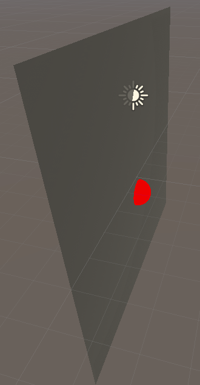
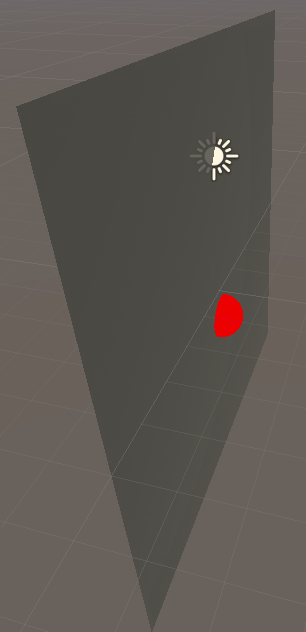
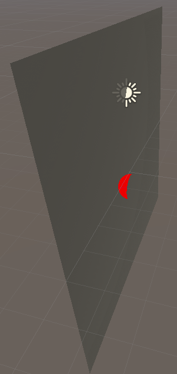
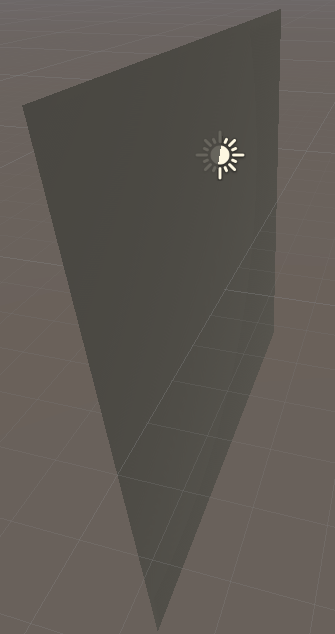
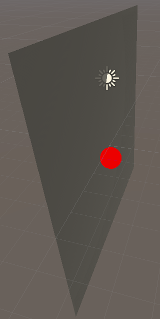
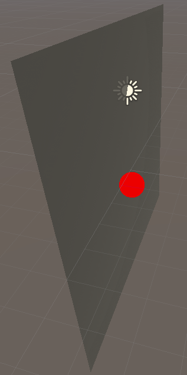

# Abstract

깊이 테스트를 해보자.

# Shader

```c
Shader "UnityShaderTutorial/basic_depth_test" {
	Properties {
		_Color ("Main Color", Color) = (1,1,1,1)
	}
	SubShader {
		Tags {"Queue"="Transparent" "IgnoreProjector"="True" "RenderType"="Transparent"}

		// extra pass that renders to depth buffer only
		Pass {
			ZTEST Less
			Color [_Color]
		}
	}
}
```

# Description

깊이 테스트란 3차원 화면에 그려진 물체를 2차원 좌표계로 옮긴 뒤 같은 서로 다른 물체가 같은 픽셀에 그려져야 할때(== 겹칠때)를 비교하여 관찰자에게 가까운 깊이 값을 깊이 버퍼에 저장하는 활동이다.

`ZTest` : 기본적으로 LEqual이 활성화. 물체의 깊이에 따라 그려줄지 판단한다.

```
ex) ZTest (Less | Greater | LEqual | GEqual | Equal | NotEqual | Always)
```

# Prerequisites

## Unity ShaderLab Overview

`Z-TEST`

+ `Less`, `LEqual`
```
관찰자와 오브젝트 사이의 거리가 작거나 같은 것들만 그린다.
```




+ `Greater`, `GEqual`

```
관찰자와 오브젝트 사이의 거리보다 크거나 같은 것들만 그린다.
```




+ `Equal`

```
관찰자와 오브젝트 사이의 거리가 같은 것들만 그린다.
```



+ `Not Equal`, `Always`

```
관찰자와 오브젝트 사이의 거리가 같지 않은 것, 깊이에 상관없이 항상 그린다.
```



