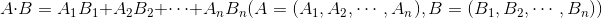
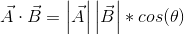
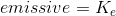
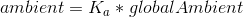
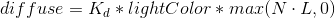
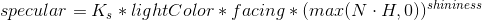

# Abstract

라이트를 켜자.

# References

* [The cg Tutorial](http://developer.download.nvidia.com/CgTutorial/cg_tutorial_chapter05.html)
  * 라이팅을 cg로 어떻게 구현하는지 설명한다.

# Shader

```c
Shader "UnityShaderTutorial/basic_light" {
	SubShader{
		Pass{
			Material{
				Diffuse(1,1,1,1)
				Ambient(1,1,1,1)
			}
			Lighting On
		}
	}
}
```

# Description

`Material` 은 `fixed-style function command` 중 하나이고 문법은 다음과 같다.

```c
  Material {
	  Material Block
  }
```

`Material Block` 은 `Diffuse, Ambient, Specular, Shiness, Emission` 과 같은 표현으로 구성될 수 있다. `Diffuse` 는 RGBA 값을 인자로 갖고 물체의 표면색을 결정한다. `Ambient` 는 RGBA 값을 인자로 갖고 환경색을 결정한다. 

`Lighting` 은 라이트를 작동할지 말지 결정한다. 작동할 때는 `On` 을 작동하지 않을 때는 `Off` 를 인자로 갖는다.

물체의 표면을 구성하는 각 점들의 색은 빛을 고려한 수식에 의해 결정된다. 수식은 너무 복잡하기에 지금은 생략한다. 위의 Shader 는 점의 최종색을 결정할 때 언급한 수식에 `Material Block` 의 `Diffuse, Ambient` 를 사용한다.

# Prerequisites

## Material Block

`Material Block` 옵션은 material이 어떻게 빛에 반응하는 것에 대한 설정을 가지고 있다. 각각의 옵션은 생략이 가능하고 그 경우 기본값은 검은색으로 들어간다.(사용하지 않음)

* Diffuse Color : 오브젝트의 기본 색상이다.

* Ambient Color : Lignting Window의 ambient light set에 맞았을 때 표현되는 색상이다.

* Specular Color : 오브젝트의 specular highlight 색상이다.

* Shininess Number : highlight의 밀집도이다. 0은 넓은 범위의 highlight를 표현하게 되고, 1은 좁은 범위를 표현하게 된다.

* Emission Color : 어떠한 라이트도 받지 않을 때의 오브젝트 색상이다.

오브젝트에 라이트가 들어올 때 최종 색상 계산은 다음과 같다.

```
Ambient * Lighting Window's Ambient Intensity setting + (Light Color * Diffuse + Light Color * Specular) + Emission
```

위의 식에서 괄호 부분은 오브젝트에 받는 모든 조명에 대해 반복 계산된다.
일반적으로 Diffuse 색상과 Ambient 색상은 동일한 값을 지정한다.

## fixed-style function commands

빛을 표현하기 위해 사용되는 `fixed-style function command` 는 다음과 같다.

* Color : 오브젝트를 solid color로 설정한다.

```c
 Color color
```

* Material : Material Block에 옵션을 넣어 오브젝트의 material property를 정의하는데 사용한다.

```c
  Material {
	Material Block
  }

```

* Lighting : 라이트 표현을 적용할 지 결정한다. `On` 옵션은 Material Block에 정의된 옵션을 적용한다. `Off` 옵션은 `Color` command의 색상을 적용한다.

```c
  Lighting On | Off
```

* SeparateSpecular : specular lighting을 추가할 지 결정한다. 쉐이더 패스의 끝에 추가하기 때문에 텍스쳐 처리에 영향을 받지 않는다. `Lighting` 옵션이 켜져있어야만 사용가능하다.

```c
  SeparateSpecular On | Off
```

* ColorMaterial : material에 설정된 색상 대신 per-vertex color를 사용한다. 각 옵션은 어떤 색상을 대체할 것인지 설정한다.

```c
  ColorMaterial AmbientAndDiffuse | Emission
```

## Render-state setup commands

Pass 는 `Material, Lighting` 과 같은 다양한 `Render-state setup` 을 포함할 수 있다. `Render-state setup` commands 는 DirectX 를 사용할 때 `Device->Set*` 과 같다.

## Dot Product

Dot Product(= Scalar Product)는 N차원 공간의 두 벡터로부터 실수값을 얻는 연산이고, 대수적 정의와 기하학적 정의 두 가지로 나뉜다.

대수적 정의의 수식은 다음과 같다.



```
A \cdot B = A_{1}B_{1} + A_{2}B_{2} + \cdots + A_{n}B_{n}
(A = (A_{1}, A_{2}, \cdots, A_{n}), B = (B_{1}, B_{2}, \cdots, B_{n}))
```

기하학적 정의의 수식은 다음과 같다. `\theta`는 두 벡터 `\vec{A}`와 `\vec{B}`가 이루는 각이다.



```
\vec{A} \cdot \vec{B} = \left | \vec{A} \right | \left | \vec{B} \right | * cos(\theta)
```

컴퓨터 연산에서 `cos(\theta)`는 비용이 큰 연산이기 때문에 기본적으로 대수적 정의의 수식을 사용한다.

## The Basic Lighting Model

Basic Lighting Model 은 Phong 모델을 확장한 것이며 수식은 다음과 같다.

```
surfaceColor = emissive + ambient + diffuse + specular
```

emissive(방출광) 는 표면에서 방출되는 빛을 나타내고 emissive 항을 구하는 방법은 다음과 같다. `K_{e}` 는 물체의 emissive color 이다.



```
emissive = K_{e}
```

ambient(주변광) 는 다른 표면에서 반사되어 물체의 색에 영향을 주는 빛을 표현한다. ambient 항을 구하는 방법은 다음과 같다. `K_{a}`는 material의 ambient 반사율, `globalAmbient`는 주변 라이팅의 색상이다.



```
ambient = K_{a} * globalAmbient
```

diffuse(확산광)은 표면의 색을 표현한다. diffuse 항을 구하는 방법은 다음과 같다. `K_{d}`는 material의 diffuse 색상, `lightColor`는 들어오는 diffuse light의 색상, `N`은 정규화된 표면 법선, `L`은 광원을 향한 노멀 벡터이다.



```
diffuse = K_{d} * lightColor * max(N \cdot L, 0)
```

[](http://developer.download.nvidia.com/CgTutorial/cg_tutorial_chapter05.html)

specular(반사광)는 표면에서 빛이 산란된 것을 표현한다. specular 항을 구하는 방법은 다음과 같다. `K_{s}`는 재질의 specular 색상, `lightColor`는 들어오는 반사광의 색상, `N`은 정규화된 표면 법선, `V`는 viewpoint에 대한 노멀 벡터, `L`은 광원을 향한 노멀 벡터, `H`는 `V`와 `L`의 중간에 있는 노멀 벡터, `shininess`는 표면의 광택도이다. `N·L`이 0보다 크면 `facing`이 1이고, 아니면 0이다. (기준각도 90도)



```
specular = K_{s} * lightColor * facing * (max(N \cdot H, 0))^{shininess}
```

[](http://developer.download.nvidia.com/CgTutorial/cg_tutorial_chapter05.html)