# Abstract

기본적인 vertex, fragment shader 를 작성하고 좌표변환을 이해하자.

# Shader

```c
Shader "UnityShaderTutorial/basic_vertex_fragment_shader" {
    Properties
    {
        _Color ("Main Color", Color) = (1,1,1,1)
    }
    SubShader
    {
        Pass
        {
            CGPROGRAM
            #pragma vertex vertexShader
            #pragma fragment fragmentShader

            float4 vertexShader (float4 vertex : POSITION) : SV_POSITION
            {
                return UnityObjectToClipPos(vertex);
            }

            fixed4 _Color;

            fixed4 fragmentShader () : SV_Target
            {
                return _Color;
            }
            ENDCG
        }
    }
}
```

# Description

vertex shader 는 vertex 개수 만큼 호출된다. fragment shader 는 fragment 개수 만큼 호출된다. 물체의 표면색을 `_Color` property 로 칠하자.

`CGPROGRAM` ~ `ENDCG` 키워드의 의미는 '이 키워드 안에서는 **CG Language** 로 작성 하겠다는 의미이다. 

`#pragma` 는 쉐이더 함수를 컴파일하겠다는 지시문으로 사용 된다. 그래서

`#pragma vertex vertexShader` : **vertex shader**의 컴파일 함수의 이름은 *vertexShader* 라는 의미를 가지며

`#pragma fragment fragmentShader` : **fragment shader**의 컴파일 함수의 이름은 *fragmentShader* 라는 의미이다.

```c
float4 vertexShader (float4 vertex : POSITION) : SV_POSITION
fixed4 fragmentShader () : SV_Target
```

함수의 구성은 아래와 같다
```c
[ReturnType] [Function Name] ([Parmeter]) : [Semantic Signifier] 
```
`Semantic Signifier` : 위 `Shader` 코드에서 **: POSITION**,  **:SV_POSITION** , **: SV_TARGET** 을 의미하는데, 각 변수들이 의미하는 바를  `GPU` 에게 설명하기 위함이다.

`Properties` 에 선언해 놓은 `_Color` 를 `CGPROGRAM` 내부에서 사용하기 위해서는 변수 선언을 해줘야 하는데, 반드시 `Properties` 에서 선언한 이름과 동일해야 하며, 코드에서 사용하기 전에 선언해야 한다.

더욱 자세한 내용은 [Unity Manual](https://docs.unity3d.com/Manual/SL-ShaderPrograms.html) 에서 확인 할 수 있다.
# Prerequisites

## Transformations

### 월드 좌표 변환
3D 환경에서 큐브를 하나 표현하려고 할때 정점 8개를 이용해서 표현할 수 있다. 그리고 큐브의 사이즈, 회전, 위치를 표현하려고 할때 
기준이되는 좌표계가 필요한데, 가장 쉬운 방법이 큐브 중심을 좌표계 원점으로하는 좌표계를 사용하는 것이다. 이 좌표계를 `로컬 좌표계`라고 한다.

위와 같이 표현된 큐브를 여러개 표현하려고 할 때에는 `로컬좌표계`로는 전체를 표현할 수 없다. `로컬 좌표계`는 각 객체에서만 의미 있기 때문이다.
그래서 `월드 좌표계`가 필요하고, 각 정점의 표현도 `월드 좌표계`를 기준으로한 값으로 다시 표현되어야 한다.

이전 [좌표계 변환](https://github.com/iamslash/UnityShaderTutorial/blob/master/Assets/Tutorials/transformations/transformations.md)
에서 봤듯이 `로컬 좌표계`를 기준으로 하는 특정 좌표를 `월드 좌표계`를 기준으로 하는 새로운 좌표로 표현하려면 좌표계 변환을 하면 된다. 
이 변환을 위해서 사용되는 행렬을 `월드 행렬 (WorldMatrix)` 이라고 하며, 아래와 같이 표현 할 수 있다. 

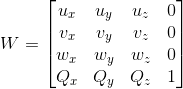
```latex
W =
\begin{bmatrix}
    u_{x} & u_{y} & u_{z} & 0 \\
    v_{x} & v_{y} & v_{z} & 0 \\
    w_{x} & w_{y} & w_{z} & 0 \\
    Q_{x} & Q_{y} & Q_{z} & 1 \\
\end{bmatrix} \\
```

이전 [좌표계 변환](https://github.com/iamslash/UnityShaderTutorial/blob/master/Assets/Tutorials/transformations/transformations.md) 에서도 언급했었듯이, 이 변환 행렬은 새로운 좌표계를 기준으로 새롭게 정의 되는 비례(S), 회전(R), 이동(T) 이 합성된것이다. 그렇기 때문에 아래와 같이 표현된다.

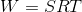


유니티의 쉐이더에서는 버텍스의 월드 좌표를 구하려고 할때 `unity_ObjectToWorld` 를 이용해서 구할 수 있다.

```c
output.position_in_world_space = mul(unity_ObjectToWorld, input.vertex);
```

### 뷰 좌표 변환

3D 환경을 화면상에 그리기 위해서는 카메라가 필요 하다. 이 카메라의 위치에 따라서, 동일한 환경이라도 보여지는 방식이 달라지게 된다.
이 카메라 또한 환경을 이루는 존재중에 하나 이다. 그렇기 때문에, 로컬 좌표계를 가지게 되는데 이 좌표계를 `뷰 좌표계` 라고 한다.
이전까지 `월드 좌표계`로 변환됬던것을 이제 `뷰 좌표계`로 변환해야 한다.

위 `월드 좌표 변환` 에서 봤듯이, 로컬 좌표계에서 월드 좌표계로 변환을 하기 위해서 사용되는 행렬 `W`를 정의 했었다. `뷰 좌표계` 또한 `카메라의 로컬좌표계` 라고 했으니, `뷰 좌표계`에서 `월드 좌표계`로 변환 할 때 `W`를 사용 할 수 있다는것을 안다. 하지만 우리가 알고 싶은것은 `월드 좌표계`에서 `뷰 좌표계` 로의 변환이기 때문에, `W` 행렬의 역행렬을 이용할 수 있다. 이 행렬을 `시야 행렬 (view matrix)` 라고 하고 아래와 같이 정의 할 수 있다.

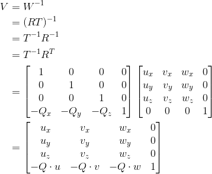

```latex
\begin{aligned}

V &= W^{-1}\\
  &= (RT)^{-1}\\
  &= T^{-1}R^{-1}\\
  &= T^{-1}R^{T}\\
  &= 
     \begin{bmatrix}
          1 & 0 & 0 & 0 \\
          0 & 1 & 0 & 0 \\
          0 & 0 & 1 & 0 \\
          -Q_{x} & -Q_{y} & -Q_{z} & 1 \\
     \end{bmatrix} 
     \begin{bmatrix}
          u_{x} & v_{x} & w_{x} & 0 \\
          u_{y} & v_{y} & w_{y} & 0 \\
          u_{z} & v_{z} & w_{z} & 0 \\
          0 & 0 & 0 & 1 \\
     \end{bmatrix} \\
  &= \begin{bmatrix}
          u_{x} & v_{x} & w_{x} & 0 \\
          u_{y} & v_{y} & w_{y} & 0 \\
          u_{z} & v_{z} & w_{z} & 0 \\
          -Q\cdot u & -Q\cdot v & -Q\cdot w & 1 \\
     \end{bmatrix} \\
\end{aligned}
```

유니티의 쉐이더에서는 버텍스의 뷰 좌표를 구하려고 할때 `UNITY_MATRIX_V` 또는 `UNITY_MATRIX_MV` 를 이용해서 구할 수 있다.

```c
output.position_in_world_space = mul(unity_ObjectToWorld, input.vertex);
output.position_in_view_space = mul(UNITY_MATRIX_V, output.position_in_world_space);

output.position_in_view_space = mul(UNITY_MATRIX_MV, input.vertex);
```

### 프로젝션 좌표 변환

뷰 좌표 변환까지 했다면, 3D환경에서 배치한 카메라의 위치와 보는 방향까지 고려한 좌표 변환이 이루어졌다. 하지만 카메라는 그 뿐만 아니라, 보는 공간의 개념도 존재 한다. 그래서 3D환경에서 카메라가 보는 공간이 2D인 모니터로 투영되야한다. 여기서 `카메라가 보는 공간`을 `절두체(frustum)` 형태로 나타낼 수 있다. 

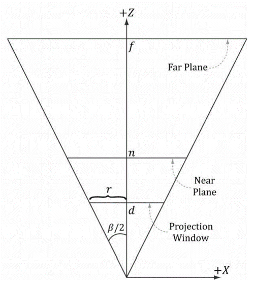
그림 1-1
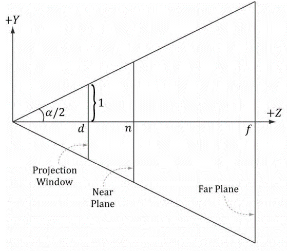
그림 1-2

위 그림들 처럼 `절두체`는 여러가지 성분으로 구성된다.

* f = 먼 평면
* n = 가까운 평면
* d = 원점에서 투영 창 까지의 거리
* α = 수직 시야각
* β = 수평 시야각
* r = 종횡비 ( 투영창의 너비(w) / 투영창의 높이(h) ) 
> 여기서 종횡비는 너비와 높이 값의 비율에 의해서 정해지는데, 실제 너비와 높이의 수치보다는 비율이 중요하기 때문에, 아래 식에서는 높이를 2로 간주 해서 서술 한다

원점에서 투영창 까지의 거리 `d` 는 다음과 같이 구할 수 있다.

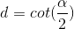

```latex
d =  cot(\frac{\alpha}{2})
```

이제 점 (x,y,z) 를 투영 창에 투영한 점 (x\`, y\`, z\`) 을 구해보자, 여기서 z\` 은 `d`와 같다.

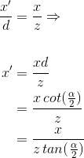

```latex
\begin{aligned} 

\frac{{x}'}{d} &= \frac{x}{z} \Rightarrow \\\\

{x}' &= \frac{xd}{z} \\
     &= \frac{x\, cot(\frac{\alpha}{2})}{z} \\
     &= \frac{x}{z\, tan(\frac{\alpha}{2})} \\

\end{aligned}
```

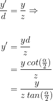

```latex
\begin{aligned} 

\frac{{y}'}{d} &= \frac{y}{z} \Rightarrow \\\\

{y}' &= \frac{yd}{z} \\
     &= \frac{y\, cot(\frac{\alpha}{2})}{z} \\
     &= \frac{y}{z\, tan(\frac{\alpha}{2})} \\

\end{aligned}
```

이때 각 축의 좌표가 `절두체` 안에 있을 필요 충분 조건은 아래와 같다.

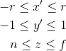

```latex
\begin{aligned} 

-r \leq {x}' \leq r\\
-1 \leq {y}' \leq 1\\
n \leq {z} \leq f\\

\end{aligned}
```

위의 식들은 `종횡비(r)` 이 반드시 필요한 수식들이다. `종횡비`를 구하기 위해서는 하드웨어의 해상도가 필요한데, 이 값은 상당히 큰 값의 정수이다.
지금 단계에서, 실제 값을 이용할 필요는 없다. 계산하기 편한 형태의 가상의 `종횡비`를 이용해서 계산하고, 차후에 스케일링해도 된다.
이때 `NDC(normalized device coordinates)` 과정이 적용 된다. 

`NDC`란 (-1, -1)~(1, 1)의 종횡비 1:1 비율을 가진 2차원 좌표계를 의미한다. `뷰 좌표계`의 모든 3차원 좌표는 이 2차원 좌표계로 표현된다.

위에서 구한 `절두체` 안에 있을 필요 충분 조건은 아래와 같이 변형 할 수 있다.

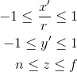

```latex
\begin{aligned} 

-1 \leq \frac{{x}'}{r} \leq 1\\
-1 \leq {y}' \leq 1\\
n \leq {z} \leq f\\

\end{aligned}
```

`NDC` 에서 x\` 은 다음과 같이 정의 될 수 있다.

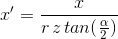

```latex
{x}' = \frac{x}{r\, z\, tan(\frac{\alpha}{2})}
```

이제 투영행렬을 구해보자, 하지만 위의 x\` 식과 y\` 식은 선형 부분과 비선형 부분이 섞여 있다. 여기서 비선형 부분은 `z` 값으로 나누는 부분이다.
그래서 `z` 에 대한 수식은 임의의 `A`, `B` 상수로 표현하고, 아직까지는 `z` 성분은 정규화 되지 않았지만 차후에 정규화 될경우 투영변환에서 나누기로 사용될 본래의 `z` 성분이 없어지는것이니, `동차좌표`의 `w` 성분에 할당을 하자. 그럼 아래와 같은 행렬 `P`를 구할 수 있다.

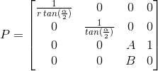

```latex
\begin{aligned}
P &= 
     \begin{bmatrix}
          \frac{1}{r\, tan(\frac{\alpha}{2})} & 0 & 0 & 0 \\
          0 & \frac{1}{tan(\frac{\alpha}{2})} & 0 & 0 \\
          0 & 0 & A & 1 \\
          0 & 0 & B & 0 \\
     \end{bmatrix} 
\end{aligned}
```

이제 이 `P` 행렬을 이용해서 임의의 점 (x,y,z,1) 을 변환 시켜보자.

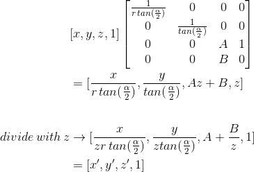

```latex
\begin{aligned}
     & [x,y,z,1] \begin{bmatrix}
          \frac{1}{r\, tan(\frac{\alpha}{2})} & 0 & 0 & 0 \\
          0 & \frac{1}{tan(\frac{\alpha}{2})} & 0 & 0 \\
          0 & 0 & A & 1 \\
          0 & 0 & B & 0 \\
     \end{bmatrix} \\
     &= [\frac{x}{r\, tan(\frac{\alpha}{2})},\frac{y}{tan(\frac{\alpha}{2})},Az+B,z]\\\\
     divide \,with \,z &\to 
        [\frac{x}{zr\, tan(\frac{\alpha}{2})},\frac{y}{ztan(\frac{\alpha}{2})},A+\frac{B}{z},1] \\
     &= [{x}', {y}', {z}', 1]
\end{aligned} 
```

이제 `z` 성분을 정규화해서 상수 `A`와 `B`만 구하면 행렬이 완성된다. `x` 와 `y`는 \[-1, 1] 로 정규화 됬지만, `z` 는 기존 범위 \[n, f] 가 \[0, 1] 로 정규화 되야 한다. 따라서 위에서 구한 z\` = A + B/z를 이용해서 서술 하면 아래와 같다.

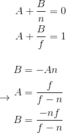

```latex
\begin{aligned}

A+\frac{B}{n} &= 0\\
A+\frac{B}{f} &= 1\\
\end{aligned}\\\\\\

\rightarrow 

\begin{aligned}

B &= -An \\
A &= \frac{f}{f-n}\\
B &= \frac{-nf}{f-n}

\end{aligned}
```

이제 투영행렬을 완성시키면 아래와 같다.

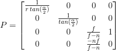

```latex
\begin{aligned}
P &= 
     \begin{bmatrix}
          \frac{1}{r\, tan(\frac{\alpha}{2})} & 0 & 0 & 0 \\
          0 & \frac{1}{tan(\frac{\alpha}{2})} & 0 & 0 \\
          0 & 0 & \frac{f}{f-n} & 1 \\
          0 & 0 & \frac{-nf}{f-n} & 0 \\
     \end{bmatrix} 
\end{aligned}
```


