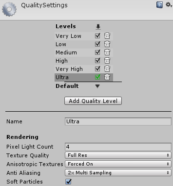
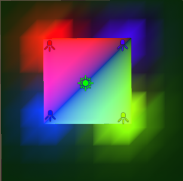
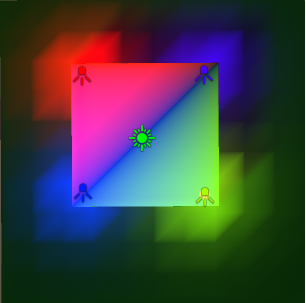
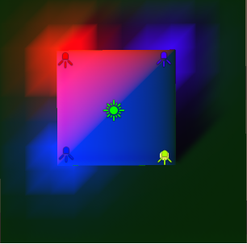
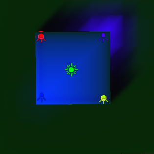
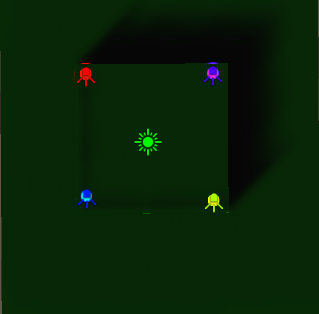

# Abstract

diffuse lighting, ambient, light probe 를 적용해보자

# Shader

```c
Shader "UnityShaderTutorial/diffuse_ambient_lightprobe" {
    Properties
    {
        [NoScaleOffset] _MainTex ("Texture", 2D) = "white" {}
    }
    SubShader
    {
        Pass
        {
            Tags {"LightMode"="ForwardBase"}
        
            CGPROGRAM
            #pragma vertex vert
            #pragma fragment frag
            #include "UnityCG.cginc"
            #include "UnityLightingCommon.cginc"

            struct v2f
            {
                float2 uv : TEXCOORD0;
                fixed4 diff : COLOR0;
                float4 vertex : SV_POSITION;
            };

            v2f vert (appdata_base v)
            {
                v2f o;
                o.vertex = UnityObjectToClipPos(v.vertex);
                o.uv = v.texcoord;
                half3 worldNormal = UnityObjectToWorldNormal(v.normal);
                half nl = max(0, dot(worldNormal, _WorldSpaceLightPos0.xyz));
                o.diff = nl * _LightColor0;

                // the only difference from previous shader:
                // in addition to the diffuse lighting from the main light,
                // add illumination from ambient or light probes
                // ShadeSH9 function from UnityCG.cginc evaluates it,
                // using world space normal
                o.diff.rgb += ShadeSH9(half4(worldNormal,1));
                return o;
            }
            
            sampler2D _MainTex;

            fixed4 frag (v2f i) : SV_Target
            {
                fixed4 col = tex2D(_MainTex, i.uv);
                col *= i.diff;
                return col;
            }
            ENDCG
        }
    }
}
```

# Description

이전챕터인 [diffuse](???) 와의 차이는 `환경광 (AmbientLight), 라이트프로브` 까지 적용된다는 점이다.

```
o.diff.rgb += ShadeSH9(half4(worldNormal,1));
```

# Prerequisites

## Forward Rendering Path

`Forward Rendering Path` 는 특정 물체에 영향을 미치는 라이트가 많을 경우 한정된 갯수의 라이트만을 `Pixel-Light`로 계산하고, 나머지 를 `Vertex-Light`나, `구면조화`로 계산된다.

`Pixel-Light`로 계산 되는 기준은 아래와 같다.

* `Light` 컴포넌트의 `Render Mode`의 값이 Important로 되어 있을 경우
* 가장 밝은 `Directional Light`
* 위 조건에 맞는 라이트의 갯수 (c), 최대 허용된 갯수 (m) = `QualitySettings의 Pixel Light Count` 일때, m - c 갯수 만큼 더 허용

더욱 자세한 내용은 [유니티 메뉴얼](https://docs.unity3d.com/Manual/RenderTech-ForwardRendering.html) 에서 확인 할 수 있다.



아래 스크린샷은 `QualitySetting의 Pixel Light Count`의 값에 따른 변화이다. 
라이트는 총 5개 ( 1 Directional Light, 4 Spot Light)

| PixelCount 0 | PixelCount 1 | PixelCount 2 | PixelCount 3 | PixelCount 4 |
|:-------:|:--------:|:--------:|:--------:|:--------:|
|  |  |  |  |   

