# Abstract

행렬대수를 정리한다.

# 행렬 곱셈

+ A의 행과 B의 열을 곱하여 값을 구한다.
+ AxB는 가능하지만 BxA는 가능하지 않다, 그 이유는 곱하려는 행과 열의 개수가 맞아야 하기때문이다.

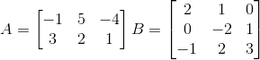
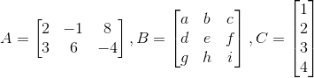

```
ex) (-1, 5, -4) x (2, 0, -1)

= -1x2 + 5x0 + -4x-1
= -2 + 0 + 4
= 2
``` 

# 전치행렬

+ 정의 : 행과 열을 교환하여 얻는 행렬이다.
+ 전치 행렬은 'T' or 't'를 사용하여 표시해준다. 

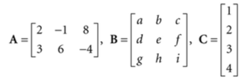
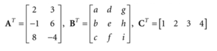

# 단위행렬

+ 정의 : 주대각선을 제외한 모든 원소가 0인 정방행렬(행과 열의 수가 같은 행렬)이다.

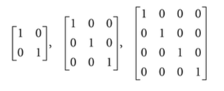

+ 단위행렬과 곱셈을 하는 경우 그대로 자신의 행렬로 돌아오는 것을 확인 할 수 있다.

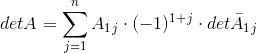

# 소행렬식

+ 정의 : n차 행렬식에서 i행과 j열의 원소를 제외한 나머지 행렬.

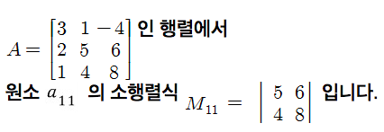

# 여인수 행렬

+ 정의 : 소행렬식에 +, - 부호를 붙인 것.

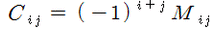

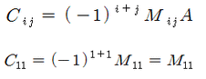

# 행렬식

+ 정의 : 행렬의 원소들을 대입하여 얻은 결과값(수치)을 지칭한다.
+ n x n (n은 2 이상)의 정방행렬을 사용한다.
+ detA11 이란 A에서 1행과 1열을 제외한 행렬의 행렬식을 의미한다.

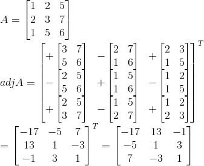
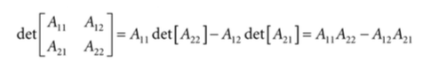
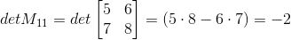

```
= A11 x (-1)(1+1) // (1+1) = 제곱이 짝수이므로 +가 된다 
  x det A11 + 
  A12 x (-1)(1+2) // (1+3) = 제곱이 홀수이므로 -가 된다.
  x det A12 ...
= A11 x det A11 -A12 x det A12 .. 
```

# 딸림행렬 (= 수반행렬)

+ 정의 : n차 정방행렬 A에 대해 A의 여인수 행렬의 전치행렬이라 의미하고, adjA라 표기한다.

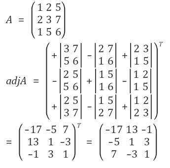

# 역행렬

+ 정의 : 곱하였을때 단위행렬이 나오게하는 행렬을 의미한다.
+ 행렬식과 딸림행렬을 이용하여 역행렬을 구할 수 있다.

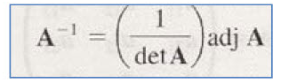

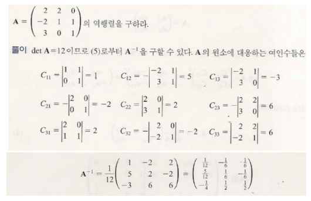