# Abstract

행렬대수를 정리한다.

# 행렬 곱셈

행렬 A의 크기가 `i x j` 라 하고 행렬 B의 크기가 
`j x k` 라고 하면 결과 행렬은 `i x k` 와 같다. 이때
행렬 A의 열의 크기와 행렬 B의 행의 크기가 같지 않으면
두 행렬은 곱셈을 할 수 없다. 

행렬의 곱셈은 교환 법칙이 성립하지 않는다. 다음은 `2 x 3` 행렬과 `3 x 3` 행렬을
곱하는 예이다.


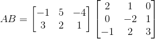


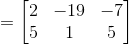

```
\\A=\begin{bmatrix}
-1 & 5 & -4\\ 
3 & 2 & 1
\end{bmatrix}
B=\begin{bmatrix}
2 & 1 & 0\\ 
0 & -2 & 1\\ 
-1 & 2 & 3
\end{bmatrix}\\
AB=\begin{bmatrix}
-1 & 5 & -4\\ 
3 & 2 & 1
\end{bmatrix}
\begin{bmatrix}
2 & 1 & 0\\ 
0 & -2 & 1\\ 
-1 & 2 & 3
\end{bmatrix}\\
= \begin{bmatrix}
(-1,5,4)\cdot (2,0,-1) & (-1,5,4)\cdot (1,-2,2) & (-1,5,4)\cdot (0,1,3)\\ 
(3,2,1)\cdot (2,0,-1) & (3,2,1)\cdot (1,-2,2) & (3,2,1)\cdot (0,1,3)
\end{bmatrix}\\
= \begin{bmatrix}
2 & -19 & -7\\ 
5 & 1 & 5
\end{bmatrix}
```

# 전치행렬

전치행렬은 각 원소들의 행과 열을 교환하여 얻는 행렬이고 `A^{T}` 와 같이 표기한다. 
다음은 전치행열의 예이다.


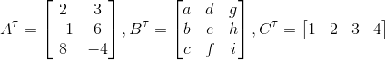

```
\\A=\begin{bmatrix}
2 & -1 & 8\\ 
3 & 6 & -4
\end{bmatrix}
, B=\begin{bmatrix}
a & b & c\\ 
d & e & f\\ 
g & h & i
\end{bmatrix}
, C=\begin{bmatrix}
1\\ 
2\\ 
3\\ 
4
\end{bmatrix}\\
A^{T}=\begin{bmatrix}
2 & 3\\ 
-1 & 6\\ 
8 & -4
\end{bmatrix}
, B^{T}=\begin{bmatrix}
a & d & g\\ 
b & e & h\\ 
c & f & i
\end{bmatrix}
, C^{T}=\begin{bmatrix}
1 & 2 & 3 & 4
\end{bmatrix}
```

# 단위행렬

단위행렬은 주대각선을 제외한 모든 원소가 0인 정방행렬(행과 열의 수가 같은 행렬)이다. 다음은
단위행렬의 예이다.


```
\\\begin{bmatrix}
1 & 0\\ 
0 & 1
\end{bmatrix}
,\begin{bmatrix}
1 & 0 & 0\\ 
0 & 1 & 0\\ 
0 & 0 & 1
\end{bmatrix}
,\begin{bmatrix}
1 & 0 & 0 & 0\\ 
0 & 1 & 0 & 0\\ 
0 & 0 & 1 & 0\\ 
0 & 0 & 0 & 1
\end{bmatrix}
```

임의 행렬은 단위행렬과 곱셈을 했을 때 다시 그행렬과 같다. 다음은 단위행렬과
곱셈의 예이다. 단위행렬은 임의의 행렬과 곱셈할 때 교환법칙이 성립한다.

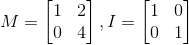

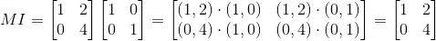

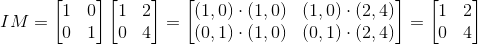

```
\\M=\begin{bmatrix}
1 & 2\\ 
0 & 4
\end{bmatrix}
,I=\begin{bmatrix}
1 & 0\\ 
0 & 1
\end{bmatrix}\\
MI=\begin{bmatrix}
1 & 2\\ 
0 & 4
\end{bmatrix}
\begin{bmatrix}
1 & 0\\ 
0 & 1
\end{bmatrix}
= \begin{bmatrix}
(1,2)\cdot (1,0) & (1,2)\cdot (0,1)\\ 
(0,1)\cdot (1,0) & (0,1)\cdot (2,4)
\end{bmatrix}
=\begin{bmatrix}
1 & 2\\ 
0 & 4
\end{bmatrix}\\
IM=\begin{bmatrix}
1 & 0\\ 
0 & 1
\end{bmatrix}
\begin{bmatrix}
1 & 2\\ 
0 & 4
\end{bmatrix}
= \begin{bmatrix}
(1,0)\cdot (1,0) & (1,0)\cdot (2,4)\\ 
(0,1)\cdot (1,0) & (0,1)\cdot (2,4)
\end{bmatrix}
=\begin{bmatrix}
1 & 2\\ 
0 & 4
\end{bmatrix}
```

# 소행렬식

소행렬식은 임의의 행렬에서 특정 행과 열을 제외한 행렬이다.
예를 들어 다음과 같은 행렬이 있을 때 `a_{11}` 의 소행렬식은
`M_{11}` 과 같다.


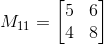

```
\\A=\begin{bmatrix}
3 & 1 & -4\\ 
2 & 5 & 6\\ 
1 & 4 & 8
\end{bmatrix}\\
M_{1}_{1}=\begin{bmatrix}
5 & 6\\ 
4 & 8
\end{bmatrix}
```

# 여인수 행렬

여인수 행렬은 소행렬식에 `+` 혹은 `-` 부호가 붙은 행렬이다.
`i + j` 가 홀수이면 여인수 행렬은 음의 행렬이고 짝수이면
양의 행렬이다.


```
C_{ij}=(-1)^{i+j}\cdot M_{ij}
```

다음은 여인수 행렬 `C_{11}`의 예이다.

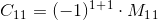

```
C_{11}=(-1)^{1+1}\cdot M_{11}
```

# 행렬식

**다시정리**

행렬식은 행렬의 원소들을 대입하여 얻은 결과값(수치)을 지칭한다.
+ n x n (n은 2 이상)의 정방행렬을 사용한다.
+ detA11 이란 A에서 1행과 1열을 제외한 행렬의 행렬식을 의미한다.

공식


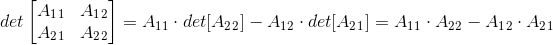

```
\\detA=\sum_{j=1}^{n}A_{1j}\cdot (-1)^{1+j}\cdot det\bar{A}_{1j}\\
det\begin{bmatrix}
A_{11} & A_{12}\\ 
A_{21} & A_{22}
\end{bmatrix}
= A_{11}\cdot det[A_{22}]-A_{12}\cdot det[A_{21}]
= A_{11}\cdot A_{22}-A_{12}\cdot A_{21}
```

ex)

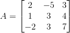

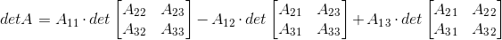

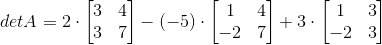

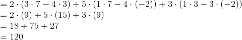

```
\\A=\begin{bmatrix}
2 & -5 & 3\\ 
1 & 3 & 4\\ 
-2 & 3 & 7
\end{bmatrix}\\
detA=A_{11}\cdot det\begin{bmatrix}
A_{22} & A_{23}\\ 
A_{32} & A_{33}
\end{bmatrix}
- A_{12}\cdot det\begin{bmatrix}
A_{21} & A_{23}\\ 
A_{31} & A_{33}
\end{bmatrix}
+ A_{13}\cdot det\begin{bmatrix}
A_{21} & A_{22}\\ 
A_{31} & A_{32}
\end{bmatrix}\\
detA=2\cdot \begin{bmatrix}
3 & 4\\ 
3 & 7
\end{bmatrix}
-(-5)\cdot \begin{bmatrix}
1 & 4\\ 
-2 & 7
\end{bmatrix}
+ 3\cdot \begin{bmatrix}
1 & 3\\ 
-2 & 3
\end{bmatrix}\\
=2\cdot (3\cdot7 - 4\cdot3)+5\cdot(1\cdot 7 - 4\cdot (-2)) + 3\cdot (1\cdot 3 - 3\cdot (-2))\\
=2\cdot (9) + 5\cdot (15) + 3\cdot (9)\\
=18 + 75 + 27\\
=120
```

```
= A11 x (-1)(1+1) // (1+1) = 제곱이 짝수이므로 +가 된다 
  x det A11 + 
  A12 x (-1)(1+2) // (1+3) = 제곱이 홀수이므로 -가 된다.
  x det A12 ...
= A11 x det A11 -A12 x det A12 .. 
```

# 딸림행렬 (수반행렬)

** 다시 정리 **

 딸림행렬은 여인수 행렬의 전치행렬을 의미하고 `adjA`라 표기한다. 
 딸림행렬은 정발행렬만 가능하다.
 다음은 `3X3` 행렬 A 의 딸림행렬 예이다.


```
\\A=\begin{bmatrix}
1 & 2 & 5\\ 
2 & 3 & 7\\ 
1 & 5 & 6
\end{bmatrix}\\
adjA=\begin{bmatrix}
+\begin{bmatrix}
3 & 7\\ 
5 & 6
\end{bmatrix} & -\begin{bmatrix}
2 & 7\\ 
1 & 6
\end{bmatrix} & +\begin{bmatrix}
2 & 3\\ 
1 & 5
\end{bmatrix}\\ 
-\begin{bmatrix}
2 & 5\\ 
5 & 6
\end{bmatrix} & +\begin{bmatrix}
1 & 5\\ 
1 & 6
\end{bmatrix} & -\begin{bmatrix}
1 & 2\\ 
1 & 5
\end{bmatrix}\\ 
+\begin{bmatrix}
2 & 5\\ 
3 & 7
\end{bmatrix} & -\begin{bmatrix}
1 & 5\\ 
2 & 7
\end{bmatrix} & +\begin{bmatrix}
1 & 2\\ 
2 & 3
\end{bmatrix}
\end{bmatrix}^{T}\\
=\begin{bmatrix}
-17 & -5 & 7\\ 
13 & 1 & -3\\ 
-1 & 3 & 1
\end{bmatrix}^{T}
=\begin{bmatrix}
-17 & 13 & -1\\ 
-5 & 1 & 3\\ 
7 & -3 & 1
\end{bmatrix}
```

# 역행렬

역행렬은 임의의 행렬과 곱하였을 때 단위행렬이 나오게 하는 행렬이고
`A^{-1}` 과 같이 표기한다. 즉 특정 행렬과 역행열을 곱하면 결과행렬은 
반드시 단위행렬이다. 또한 행렬식과 딸림행렬을 이용하여 다음과 같이 역행렬을 구할 수 있다.


```
A^{-1}=\left ( \frac{1}{detA} \right )\cdot adjA
```

다음은 앞서 언급한 공식을 이용하여 역행렬을 구하는 예이다.

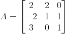

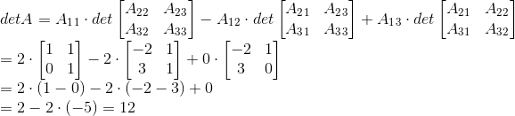

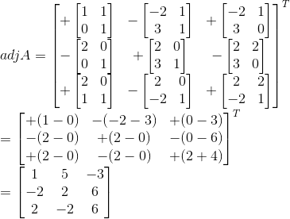

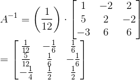

```
\\A=\begin{bmatrix}
2 & 2 & 0\\ 
-2 & 1 & 1\\ 
3 & 0 & 1
\end{bmatrix}\\
detA=A_{11}\cdot det\begin{bmatrix}
A_{22} & A_{23}\\ 
A_{32} & A_{33}
\end{bmatrix}
-A_{12}\cdot \begin{bmatrix}
A_{21} & A_{23}\\ 
A_{31} & A_{33}
\end{bmatrix}
+A_{13}\cdot det\begin{bmatrix}
A_{21} & A_{22}\\ 
A_{31} & A_{32}
\end{bmatrix}\\
=2\cdot \begin{bmatrix}
1 & 1\\ 
0 & 1
\end{bmatrix}
-2\cdot \begin{bmatrix}
-2 & 1\\ 
3 & 1
\end{bmatrix}
+0\cdot \begin{bmatrix}
-2 & 1\\ 
3 & 0
\end{bmatrix}\\
=2\cdot (1-0) - 2\cdot (-2-3) + 0\\
=2 - 2\cdot (-5) = 12\\
adjA=\begin{bmatrix}
+\begin{bmatrix}
1 & 1\\ 
0 & 1
\end{bmatrix} & -\begin{bmatrix}
-2 & 1\\ 
3 & 1
\end{bmatrix} & +\begin{bmatrix}
-2 & 1\\ 
3 & 0
\end{bmatrix}\\ 
-\begin{bmatrix}
2 & 0\\ 
0 & 1
\end{bmatrix} & +\begin{bmatrix}
2 & 0\\ 
3 & 1
\end{bmatrix} & -\begin{bmatrix}
2 & 2\\ 
3 & 0
\end{bmatrix}\\ 
+\begin{bmatrix}
2 & 0\\ 
1 & 1
\end{bmatrix} & -\begin{bmatrix}
2 & 0\\ 
-2 & 1
\end{bmatrix} & +\begin{bmatrix}
2 & 2\\ 
-2 & 1
\end{bmatrix}
\end{bmatrix}^{T}\\
\begin{bmatrix}
+(1-0) & -(-2-3) & +(0-3)\\ 
-(2-0) & +(2-0) & -(0-6)\\ 
+(2-0) & -(2-0) & +(2+4)
\end{bmatrix}^{T}\\
=\begin{bmatrix}
1 & 5 & -3\\ 
-2 & 2 & 6\\ 
2 & -2 & 6
\end{bmatrix}\\
A^{-1}=\left ( \frac{1}{12} \right )\cdot \begin{bmatrix}
1 & -2 & 2\\ 
5 & 2 & -2\\ 
-3 & 6 & 6
\end{bmatrix}\\
=\begin{bmatrix}
\frac{1}{12} & -\frac{1}{6} & \frac{1}{6}\\ 
\frac{5}{12} & \frac{1}{6} & -\frac{1}{6}\\ 
-\frac{1}{4} & \frac{1}{2} & \frac{1}{2}
\end{bmatrix}
```
