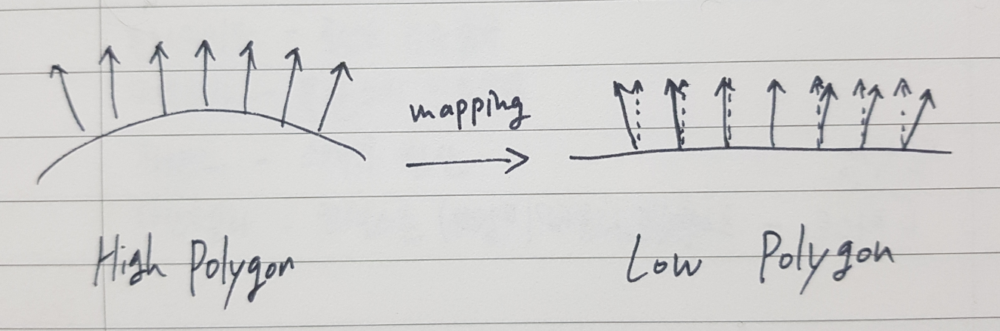
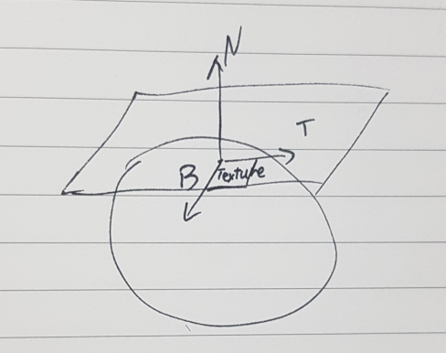
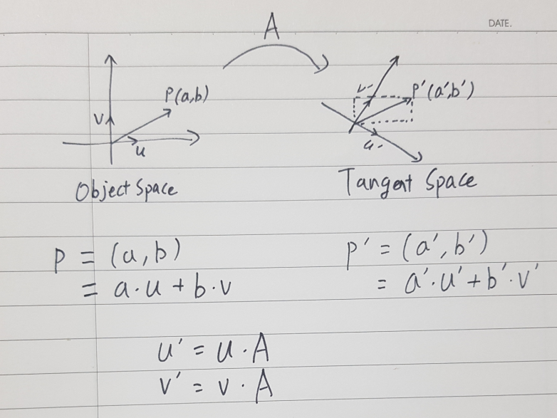
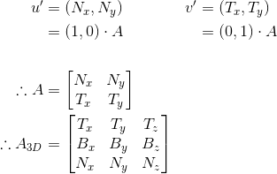
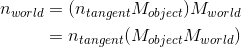
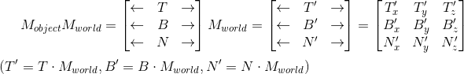

# Abstract

물체에 노멀맵을 적용해보자.

# Shader

```c
Shader "UnityShaderTutorial/normal_map" {
    Properties {
        // normal map texture on the material,
        // default to dummy "flat surface" normalmap
        _MainTex ("Texture", 2D) = "white" {}
        _BumpMap("Normal Map", 2D) = "bump" {}
    }
    SubShader {
        Pass {
	    Tags { "LightMode" = "ForwardBase" }

            CGPROGRAM
            #pragma vertex vert
            #pragma fragment frag
            #include "UnityCG.cginc"
	        #include "UnityLightingCommon.cginc" // for _LightColor0

            struct v2f {
                // these three vectors will hold a 3x3 rotation matrix
                // that transforms from tangent to world space
                half3 tspace0 : TEXCOORD1; // tangent.x, bitangent.x, normal.x
                half3 tspace1 : TEXCOORD2; // tangent.y, bitangent.y, normal.y
                half3 tspace2 : TEXCOORD3; // tangent.z, bitangent.z, normal.z
                // texture coordinate for the normal map
                float2 uv : TEXCOORD4;
                float4 pos : SV_POSITION;

				fixed4 diff : COLOR0; // diffuse lighting color
            };
			
            // vertex shader now also needs a per-vertex tangent vector.
            // in Unity tangents are 4D vectors, with the .w component used to
            // indicate direction of the bitangent vector.
            // we also need the texture coordinate.
            v2f vert (float4 vertex : POSITION, float3 normal : NORMAL, float4 tangent : TANGENT, float2 uv : TEXCOORD0) {
                v2f o;
                o.pos = UnityObjectToClipPos(vertex);
                half3 wNormal = UnityObjectToWorldNormal(normal);
                half3 wTangent = UnityObjectToWorldDir(tangent.xyz);
                // compute bitangent from cross product of normal and tangent
				// -1 또는 1이다. OpenGL과 DirectX의 UV 좌표계 방향이 다르기 때문에 정확하게 방향을 표현할 필요가 있음.
				// https://forum.unity.com/threads/what-is-tangent-w-how-to-know-whether-its-1-or-1-tangent-w-vs-unity_worldtransformparams-w.468395/
                half tangentSign = tangent.w * unity_WorldTransformParams.w; 
												 
				half3 wBitangent = cross(wNormal, wTangent) * tangentSign;
                // output the tangent space matrix
                o.tspace0 = half3(wTangent.x, wBitangent.x, wNormal.x);
                o.tspace1 = half3(wTangent.y, wBitangent.y, wNormal.y);
                o.tspace2 = half3(wTangent.z, wBitangent.z, wNormal.z);
                o.uv = uv;

				half nl = max(0, dot(wNormal, _WorldSpaceLightPos0.xyz));
				// factor in the light color
				o.diff = nl * _LightColor0;
                return o;
            }
			
            sampler2D _MainTex;
            sampler2D _BumpMap;
            
            fixed4 frag (v2f i) : SV_Target {
                // sample the normal map, and decode from the Unity encoding
                half3 tnormal = UnpackNormal(tex2D(_BumpMap, i.uv));
                // transform normal from tangent to world space
                half3 worldNormal;
                worldNormal.x = dot(i.tspace0, tnormal);
                worldNormal.y = dot(i.tspace1, tnormal);
                worldNormal.z = dot(i.tspace2, tnormal);
				
                half diff_factor = saturate(dot(worldNormal, _WorldSpaceLightPos0.xyz));
				//float3 viewDirection = normalize(UnityWorldSpaceViewDir(i.pos));
				//half diff_factor = saturate(dot(worldNormal, -viewDirection));

				fixed4 c = tex2D(_MainTex, i.uv);
				c.rgb *= i.diff; // light color
				c.rgb *= diff_factor;
                return c;
            }
            ENDCG
        }
    }
}
```

# Description

노멀 매핑은 물체의 법선 벡터 값을 조작하여 물체에 표현되어 있지 않은 입체감과 질감을 구현하는 방법이다. 



위의 그림에서 low polygon 오브젝트의 경우, 실선은 실제 오브젝트의 노멀 벡터이고, 점선은 high polygon 오브젝트의 노멀 벡터이다. 라이팅 연산을 할 때 실선 벡터 대신 점선 벡터를 사용하여 색상을 표현하게 된다.

노멀 매핑을 사용하기 위해서는 기본적으로 물체의 색을 표현하는 디퓨즈 텍스쳐 외에 high polygon 오브젝트의 노멀 벡터를 저장해놓은 노멀맵 이라는 텍스쳐가 추가로 필요하다.


노멀맵은 각 픽셀의 컬러값(r, g, b)을 노멀 벡터의 값(x, y, z)으로 표현해놓은 텍스쳐이며 모든 종류의 그래픽스 이펙트(조명, 반사, 실루엣 등)에 사용된다.

노멀맵은 두 가지 종류가 있다. 
 * 오브젝트의 좌표계를 기준으로 한 벡터들을 컬러값에 저장한 `Object Space Normal Map`
 * 각 픽셀의 표면에 생성되는 좌표계를 기준으로 한 벡터들을 컬러값에 저장한 `Tangent Space Normal Map`

`Object Space Normal Map` 는 high polygon 오브젝트의 노멀 벡터 값을 그대로 컬러값에 저장한 텍스쳐이다. 오브젝트 좌표계를 사용하기 때문에  x, y, z값이 고루 분포되어 알록달록한 그림이 저장된다.

`Tangent Space Normal Map`은 low polygon 오브젝트의 노멀 벡터와 접선들로 만들어지는 평면의 두 벡터를 기저벡터로 하는 좌표계를 사용하여 high polygon 오브젝트에서 그려진 노멀 벡터의 값을 RGB 값에 매핑하여 저장한 것이다. 표면을 기준으로 하기 때문에 대부분이 z 방향을 띄어 파란색으로 보이게 된다.



`Tangent Space Normal Map`에서 사용하는 좌표계는 텍셀마다 다르게 생성된다. `N`이 픽셀의 노멀 벡터일 때, `Tangent Space`는 `dot(N, T) = 0` 을 만족하는 모든 T의 집합 공간을 의미하는데, 3D공간에서 픽셀에 접하는 평면으로 나타나게 된다. 이 평면 위에서 디퓨즈 텍스쳐의 U 방향과 일치하는 벡터를 `Tangent Vector(T)`, V 방향과 일치하는 벡터를 `Binormal Vector(B)`라 한다. 텍셀에서 사용하는 좌표계는 위의 T, B, N 벡터를 기저벡터로 사용하는 좌표계이다.

`Object Space Normal Map`보다 `Tangent Space Normal Map`을 훨씬 많이 사용한다. `Tangent Space Normal Map`의 장점은
 * 여러 메쉬에 동일하게 사용이 가능하다.
 * 움직이는 오브젝트의 Normal Vector를 구하기 쉽다.
 * 노멀 벡터의 Z값이 항상 양수여서 XY값으로 Z값을 구할 수 있기 때문에 노멀맵 파일 크기를 줄일 수 있다.
등이 있다.


`Tangent Space Normal Map`를 실제 셰이더에서 사용하려면 TBN 좌표계를 기준으로 하는 노멀 벡터를 월드 좌표계로 변경시켜야 한다.



우리는 .fbx 파일로부터 오브젝트 좌표계를 사용하는 노멀과 탄젠트 벡터를 얻을 수 있다. 위의 그림에 오브젝트 좌표계 벡터, 노멀과 탄젠트 벡터를 대입하면 행렬 A가 노멀 벡터와 탄젠트 벡터로 구성되는 것을 확인할 수 있다. 이를 삼차원으로 확장시켜서 생각해보면, 행렬 A는 탄젠트 좌표계의 기저벡터 요소들로 이루어져 있는 것을 알 수 있다.

주의할 점: 행렬 A는 좌표계 변환 행렬이기 때문에 내부 구성요소 변환 시 역행렬을 취해주어야 한다.
```
A = M_{object} (tangent to object)
A^{-1} = M_{tangent} (object to tangent)
```

우리가 구하고자 하는 값은 오브젝트 좌표계의 한 벡터이고, 탄젠트 좌표계의 노멀 벡터를 알고 있기 때문에, 탄젠트 좌표계의 노멀 벡터에 아래의 `A_{3D}` 행렬을 곱하면 오브젝트 좌표계의 벡터값을 구할 수 있다.



```
\begin{aligned} \\
 u' &= (N_{x},N_{y}) & v' &= (T_{x},T_{y})  \\
    &= (1,0)\cdot A & &= (0,1)\cdot A \\
 \\
\therefore A &=  \begin{bmatrix} N_{x} & N_{y}
                      \\ T_{x} & T_{y}
                      \end{bmatrix} \\

\therefore A_{3D} &= \begin{bmatrix}
                         T_{x} & T_{y} & T_{z}\\ 
                         B_{x} & B_{y} & B_{z}\\ 
                         N_{x} & N_{y} & N_{z}\\ 
                     \end{bmatrix} \\ 
\end{aligned} 
```

셰이더에서 `Tangent Space Normal Map`을 사용하려면 노멀 맵의 벡터를 최종적으로 월드 좌표계로 변환시켜야 한다. 오브젝트 좌표계에서 월드 좌표계로 변환하는 행렬은 유니티에서 제공하고 있기 때문에 앞서 제작한 
`M_{object}`와 곱해주면 된다.



```
\begin{aligned} \\
 n_{world} &= (n_{tangent}M_{object})M_{world} \\
           &= n_{tangent}(M_{object}M_{world}) \\
\end{aligned} 
```

`M_{object}M_{world}`의 경우 곱하면 TBN 벡터의 월드 좌표를 값으로 가지는 행렬으로 변경된다.



```
 M_{object}M_{world} = \begin{bmatrix} 
                           \leftarrow  & T & \rightarrow \\
                           \leftarrow  & B & \rightarrow \\
                           \leftarrow  & N & \rightarrow \\
                       \end{bmatrix}M_{world} 
                     = \begin{bmatrix}
                           \leftarrow  & T' & \rightarrow \\
                           \leftarrow  & B' & \rightarrow \\
                           \leftarrow  & N' & \rightarrow \\
                       \end{bmatrix}
                     = \begin{bmatrix}
                           T'_{x} & T'_{y} & T'_{z} \\
                           B'_{x} & B'_{y} & B'_{z} \\
                           N'_{x} & N'_{y} & N'_{z} \\
                       \end{bmatrix} \\
\\
(T'=T \cdot M_{world}, B'=B \cdot M_{world}, N'=N \cdot M_{world})
```


위 셰이더에서는 Unity의 내장 셰이더 첨부 파일을 사용하였다.

```
#include "UnityCG.cginc"
```

여기서 제공하는 함수들 중 `UnityObjectToClipPos`와 `UnityObjectToWorldNormal`, `UnityObjectToWorldDir`을 사용하였다. `UnityObjectToClipPos`는 오브젝트 공간의 한 점을 동일 좌표에 있는 카메라의 클립 공간으로 변환하는 함수이며, `UnityObjectToWorldNormal`은 오브젝트의 노멀 벡터를 월드 좌표의 벡터로 변환하는 함수이다. `UnityObjectToWorldDir`은 `UnityObjectToWorldNormal`와 비슷하게 오브젝트의 로컬 좌표를 월드좌표로 변환하는 함수이다.

vertex shader에서 `tangent, bitangent, normal`값을 구해서 fragment shader로 넘겨주는데, 이는 `Tangent Space Normal Map`에 저장된 노멀 벡터를 월드 좌표의 벡터로 변환하는 데 사용된다.

`uv` 값은 노멀 맵에서 현재 픽셀의 좌표를 찾는 데에 사용된다.


fragment shader에서는 vertex shader에서 계산한 tangent 값으로 노멀 맵의 벡터를 구하여 `_MainTex`의 값과 연산하여 최종 컬러 값을 결정하는 작업을 한다.

`UnpackNormal` 함수는 `_BumpMap`에 들어있는 컬러값을 변환하여 노멀 벡터 값으로 만드는 역할을 한다. `UnpackNormal` 함수 내부는 다음과 같다.

```
inline fixed3 UnpackNormal(fixed4 packednormal) {
#if defined(UNITY_NO_DXT5nm)
    return packednormal.xyz * 2 - 1;
#else
    return UnpackNormalmapRGorAG(packednormal);
#endif
}
// Unpack normal as DXT5nm (1, y, 1, x) or BC5 (x, y, 0, 1)
// Note neutral texture like "bump" is (0, 0, 1, 1) to work with both plain RGB normal and DXT5nm/BC5
fixed3 UnpackNormalmapRGorAG(fixed4 packednormal) {
    // This do the trick
   packednormal.x *= packednormal.w;

    fixed3 normal;
    normal.xy = packednormal.xy * 2 - 1;
    normal.z = sqrt(1 - saturate(dot(normal.xy, normal.xy)));
    return normal;
}
```
위의 함수에서 컬러값(0 ~ 1)을 노멀 벡터 값(-1 ~ 1)로 변경하는 작업을 하는 것을 알 수 있다.

DXT5nm와 BC5는 텍스쳐 손실 압축방법(Lossy Texture Compression Algorithms) 중 하나이며, 해당 텍스쳐를 decompress하기 위해 위의 함수에서는 특별한 공정과정을 거친다. 자세한 정보는 [여기](https://www.nvidia.com/object/real-time-normal-map-dxt-compression.html)에서 확인할 수 있다.

`UnityWorldSpaceViewDir` 함수는 메인 카메라가 주어진 좌표를 바라보는 방향 벡터를 반환하는 작업을 한다.

`diffuse` 값은 노멀 맵에 저장되어 있던 벡터와 `UnityWorldSpaceViewDir`함수로 구한 방향 벡터를 내적하여 해당 픽셀을 어둡게 표현할 것인지 판단하는 기준값이다. 0 ~ 1의 값을 가지며, 방향벡터와 수직에 가까울 수록 0에 수렴하는 값을 갖게 되어 검게 표현된다.

최종적으로 화면에 표시되는 컬러값은 `_MainTex`의 컬러값 * diffuse 값이 된다.

# Prerequisites

## Tangent, BiTangent Vector

Tangent의 뜻은 Touching, and no Intersect, 즉 한점에 접한다는 의미이다. 

3D Graphics에서 말하는 Tangent Vector는 Normal Vector에 수직인 벡터이고 BiTangent Vector는 Tangent Vector와 Normal Vector에 수직인 벡터이다.

Tangent Vector는 Normal Vector에 아무 벡터나 Cross Product 연산을 하면 구할 수 있다.

삼차원에서 한 Normal Vector에 수직인 벡터는 Normal Vector를 법선 벡터로 하는 평면상의 모든 벡터가 해당되기 때문에 무한히 존재하는데, 한개의 벡터를 사용하기 위해 통상적으로 텍스쳐 좌표인 UV좌표와 일치하는 벡터를 사용한다.

U좌표와 일치하는 벡터를 Tangent Vector, V좌표와 일치하는 벡터를 BiTangent Vector로 부른다.

## Why Use Normap?

물체를 사실적으로 표현하기 위해서는 물체를 이루고 있는 꼭지점의 개수가 많아야 한다. 그리고 꼭지점의 개수는 파일 크기와 메모리 점유율, 해당 물체를 화면에 그리기 위한 필요 연산량과 비례한다. 

이러한 한계를 개선하기 위해 꼭지점 수가 많은 물체의 법선 벡터를 텍스쳐에 저장하여 실제 물체의 꼭지점 수가 줄어도 티가 나지 않게 처리하는 기술을 사용하게 되었다. 이 기술을 노멀 매핑(Normal Mapping)이라 하고, 이 때 법선 벡터가 저장되는 텍스쳐를 노멀맵(Normal Map) 텍스쳐라고 한다.

노멀맵 텍스쳐를 사용하면 텍스쳐 1장으로 저해상도의 모델 데이터를 고해상도의 모델과 흡사하게 표현해준다. 파일의 용량, 메모리의 사용량, 연산량 전부 획기적으로 줄어든다.

단점은, 고해상도의 모델에서 노말맵을 생성한 뒤 저해상도의 모델을 또 만들어야 하기 때문에 전체적으로 모델을 만드는 시간이 오래 걸린다.

 