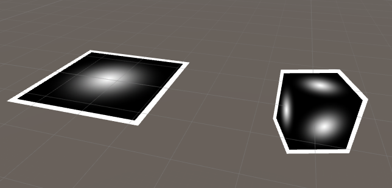
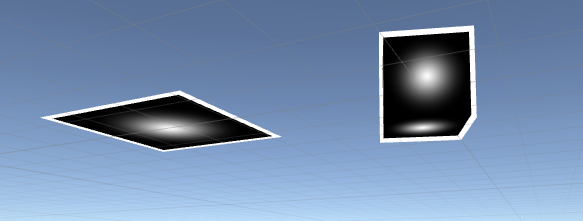

# Abstract

외곽선을 적용해보자

# Shader

```c
Shader "Unlit/test_outline"
{
	Properties {
		_MainTex ("Texture", 2D) = "white" {}
		_OutlineColor("Outline Color", Color) = (0, 0, 0, 1)
		_OutlineWidth("Outline Width", Range(0, 5)) = 1
	}

	SubShader {
		Tags{ "Queue" = "Transparent"}

		Pass {	// Render Outline
			ZWrite off
			cull off

			CGPROGRAM
			#pragma vertex vert
			#pragma fragment frag

			struct appdata {
				float4 vertex : POSITION;
			};

			struct v2f {
				float4 pos : SV_POSITION;
			};

			float _OutlineWidth;
			float4 _OutlineColor;

			v2f vert(appdata v) {
				v.vertex *= _OutlineWidth;

				v2f o;
				o.pos = UnityObjectToClipPos(v.vertex);
				return o;
			}

			float4 frag(v2f i) : COLOR {
				return _OutlineColor;
			}
			ENDCG
		}


		Pass {	// Normal Render
			ZWrite on
			cull off

			SetTexture[_MainTex]
		}
	}
}
```

# Description

`ZWrite`를 이용하여 첫번째 pass에서 깊이 버퍼를 사용하지 않도록 아웃라인을 그리고 두번째 pass에서는 깊이 버퍼를 이용하여 Texture가 매핑된 Object를 그려준다. 그러면 깊이 테스트(`ZTest`)를 통해 깊이가 있는 두번째 pass가 첫번째 pass보다 앞에 있는 것처럼 그려지도록 된다.

`cull`을 이용하여 앞과 뒷면을 모두 그려주도록 한다


