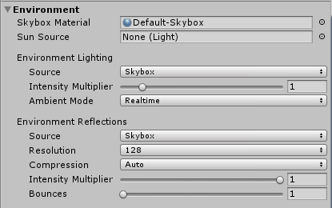
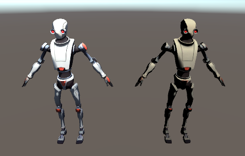

# Abstract

ramp 셰이더를 만들어보자

# Shader

```c
Shader "Custom/RampWithSlider" {
	Properties
	{
		_Color("Main Color", Color) = (1,1,1,1)
		_MainTex("Main Texture", 2D) = "white" {}

	[Header(RAMP SETTING)]
		_RampThreshold("Threshold", Range(0,1)) = 0.5
		_RampSmooth("Smoothing", Range(0.001,1)) = 0.1
	}
	
	SubShader
	{
		Tags { "RenderType" = "Opaque" }

		Pass
		{
			Tags { "LightMode" = "ForwardBase" }

			CGPROGRAM
			#pragma vertex vert
			#pragma fragment frag

			#include "UnityCG.cginc"
			#include "Lighting.cginc"	//for _LightColor0

			fixed4 _Color;
			sampler2D _MainTex;
			half _RampThreshold;
			half _RampSmooth;

			struct v2f {
				float4 pos : SV_POSITION;
				float2 uv : TEXCOORD0;			// _MainTex
				float3 worldNormal : TEXCOORD1;
				float3 worldPos : TEXCOORD2;
			};

			struct lightInput {
				fixed3 Albedo;
				fixed3 Normal;
				fixed Alpha;
			};

			float4 _MainTex_ST;

			v2f vert(appdata_base v) {
				v2f o;

				o.pos = UnityObjectToClipPos(v.vertex);
				o.uv = v.texcoord;
				o.worldPos = mul(unity_ObjectToWorld, v.vertex).xyz;
				o.worldNormal = UnityObjectToWorldNormal(v.normal);

				return o;
			}

			fixed4 frag(v2f i) : SV_Target {
				fixed3 light_dir = normalize(UnityWorldSpaceLightDir(i.worldPos));

				lightInput o;

				fixed4 mainTex = tex2D(_MainTex, i.uv);
				o.Albedo = mainTex.rgb * _Color.rgb;
				o.Alpha = mainTex.a * _Color.a;

				o.Normal = normalize(i.worldNormal);
				fixed ndl = max(0, dot(o.Normal, light_dir));

				fixed3 ramp = smoothstep(_RampThreshold - _RampSmooth * 0.5, _RampThreshold + _RampSmooth * 0.5, ndl);

				fixed4 c = 0;
				c.rgb = o.Albedo * _LightColor0.rgb * ramp;
				c.a = o.Alpha;

				UNITY_OPAQUE_ALPHA(c.a);
				return c;
			}
			ENDCG
		}
	}
}
```

# Description

* smoothstep(min,max,x) : Hermite Interpolation(에르미트 보간법)을 사용
	* x가 [min, max] 사이의 값인 경우에 대해서 [0, 1] 사이에서 부드럽게 변하는 
    Hermite 보간법을 리턴한다. x가 min보다 작다면 0을 리턴하고, max보다 크다면 1을 리턴한다.


* Environment Lighting의 Intensity Mutiplier 값에 따라 결과가 달라짐
	* Intensity Mutiplier : 디퓨즈 환경광 밝기를 설정하는 데 사용

* Intensity Mutiplier = 0일때

* 왼쪽 : tcp generated shader 적용
* 오른쪽 : RampWithSlider shader 적용 (threshold = 0.5, smoothing = 0.1)
* Intensity Mutiplier = 1일때

* 왼쪽 : tcp generated shader 적용
* 오른쪽 : RampWithSlider shader 적용 (threshold = 0.5, smoothing = 0.1)
