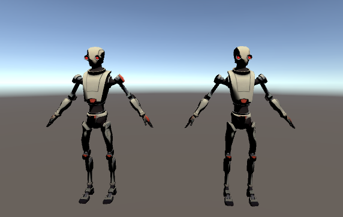

# Abstract

ramp 셰이더를 만들어보자

# Shader

```c
Shader "Custom/RampWithSlider" {
	Properties
	{
		_Color("Main Color", Color) = (1,1,1,1)
		_MainTex("Main Texture", 2D) = "white" {}

	[Header(RAMP SETTING)]
		_RampThreshold("Threshold", Range(0,1)) = 0.5
		_RampSmooth("Smoothing", Range(0.001,1)) = 0.1
	}
	SubShader
	{
		Tags { "RenderType" = "Opaque" }

		Pass
		{
			Tags { "LightMode" = "ForwardBase" }

			CGPROGRAM
			#pragma vertex vert
			#pragma fragment frag
			#pragma multi_compile_fwdbase

			#include "UnityCG.cginc"
			#include "Lighting.cginc"	//for UnityGI

			fixed4 _Color;
			sampler2D _MainTex;
			half _RampThreshold;
			half _RampSmooth;

			struct v2f {
				float4 pos : SV_POSITION;
				float2 uv : TEXCOORD0;			// _MainTex
				float3 worldNormal : TEXCOORD1;
				float3 worldPos : TEXCOORD2;
			};

			struct lightInput {
				fixed3 Albedo;
				fixed3 Normal;
				fixed Alpha;
			};

			inline half4 LightingCustom(inout lightInput i, UnityGI gi) {
				half3 light_dir = gi.light.dir;

				i.Normal = normalize(i.Normal);
				fixed ndl = max(0, dot(i.Normal, light_dir));

				fixed3 ramp = smoothstep(_RampThreshold - _RampSmooth * 0.5, _RampThreshold + _RampSmooth * 0.5, ndl);

				fixed4 c;
				c.rgb = i.Albedo * _LightColor0.rgb * ramp;
				c.a = i.Alpha;

				#ifdef UNITY_LIGHT_FUNCTION_APPLY_INDIRECT
				c.rgb += i.Albedo * gi.indirect.diffuse;
				#endif

				return c;
			}

			float4 _MainTex_ST;

			v2f vert(appdata_base v) {
				v2f o;

				o.pos = UnityObjectToClipPos(v.vertex);
				o.uv = TRANSFORM_TEX(v.texcoord, _MainTex);

				o.worldPos = mul(unity_ObjectToWorld, v.vertex).xyz;
				o.worldNormal = UnityObjectToWorldNormal(v.normal);

				return o;
			}

			fixed4 frag(v2f i) : SV_Target {
				half2 uv_MainTex;
				uv_MainTex.x = 1.0;
				uv_MainTex = i.uv;

				float3 world_pos = i.worldPos;
				fixed3 light_dir = normalize(UnityWorldSpaceLightDir(world_pos));
				float3 world_view_dir = normalize(UnityWorldSpaceViewDir(world_pos));

				lightInput o;

				o.Normal = i.worldNormal;

				fixed4 mainTex = tex2D(_MainTex, uv_MainTex);
				o.Albedo = mainTex.rgb * _Color.rgb;
				o.Alpha = mainTex.a * _Color.a;

				fixed4 c = 0;

				// Setup lighting environment
				UnityGI gi;
				UNITY_INITIALIZE_OUTPUT(UnityGI, gi);
				gi.indirect.diffuse = 0;
				gi.indirect.specular = 0;
				gi.light.color = _LightColor0.rgb;
				gi.light.dir = light_dir;

				#if UNITY_SHOULD_SAMPLE_SH
				gi.indirect.diffuse = ShadeSHPerPixel(o.Normal, 0.0, world_pos);
				#endif

				c += LightingCustom(o, gi);
				UNITY_OPAQUE_ALPHA(c.a);
				return c;
			}
			ENDCG
		}
	}
}

```

# Description
* multi_compile_fwdbase : ForwardBase 패스 타입에 필요한 모든 배리언트를 컴파일
```c
#define UNITY_SHOULD_SAMPLE_SH (defined(LIGHTPROBE_SH) && !defined(UNITY_PASS_FORWARDADD) && !defined(UNITY_PASS_PREPASSBASE) && !defined(UNITY_PASS_SHADOWCASTER) && !defined(UNITY_PASS_META))
```
* UNITY_SHOULD_SAMPLE_SH : SH(light probe/ambient) 계산이 필요할 때 사용

* 구조체
```c
struct UnityGI{
 UnityLight light;
 UnityIndirect indirect;
}

struct UnityLight{
    half3 color;
    half3 dir;
}

struct UnityIndirect{
    half3 diffuse;
    half3 specular;
}
```
* smoothstep(min,max,x) : Hermite Interpolation(에르미트 보간법)을 사용

-----

* 왼쪽 : standard shader 적용
* 오른쪽 : custom shader 적용 (threshold = 0.5, smoothing = 0.5)

