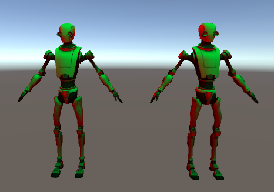

# Abstract

ramp 셰이더를 만들어보자

# Shader

```c
Shader "Custom/RampWithTexture" {
	Properties
	{
		_MainTex("Main Texture", 2D) = "white" {}

	[Header(RAMP SETTING)]
	_Ramp("Ramp (RGB)", 2D) = "gray" {}
	}
	SubShader
	{
		Tags { "RenderType" = "Opaque" }

		Pass
		{
			Tags { "LightMode" = "ForwardBase" }

CGPROGRAM
			#pragma vertex vert
			#pragma fragment frag
			#pragma multi_compile_fwdbase

			#include "UnityCG.cginc"
			#include "Lighting.cginc"	//for _LightColor0

			sampler2D _MainTex;
			sampler2D _Ramp;

			struct v2f {
				float4 pos : SV_POSITION;
				float2 uv : TEXCOORD0;			// _LightColor0
				float3 worldNormal : TEXCOORD1;
				float3 worldPos : TEXCOORD2;
			};

			float4 _MainTex_ST;

			v2f vert(appdata_base v) {
				v2f o;

				o.pos = UnityObjectToClipPos(v.vertex);
				o.uv = TRANSFORM_TEX(v.texcoord, _MainTex);

				o.worldPos = mul(unity_ObjectToWorld, v.vertex).xyz;
				o.worldNormal = UnityObjectToWorldNormal(v.normal);

				return o;
			}

			fixed4 frag(v2f i) : SV_Target{
				fixed3 N = normalize(i.worldNormal);
				fixed3 L = normalize(UnityWorldSpaceLightDir(i.worldPos));
				fixed4 mainTex = tex2D(_MainTex, i.uv);

				fixed4 c;

				fixed ndl = max(0, dot(N, L));
				fixed3 ramp = tex2D(_Ramp, fixed2(ndl, ndl)).rgb;
				c.rgb = mainTex.rgb * _LightColor0.rgb * ramp;
#if UNITY_SHOULD_SAMPLE_SH
				c.rgb += mainTex.rgb * ShadeSHPerPixel(N, 0.0, i.worldPos);
#endif
				c.a = mainTex.a;
				UNITY_OPAQUE_ALPHA(c.a);
				return c;
			}
ENDCG
		}
	}
}


```

# Description
* multi_compile_fwdbase : ForwardBase 패스 타입에 필요한 모든 배리언트를 컴파일
```c
#define UNITY_SHOULD_SAMPLE_SH (defined(LIGHTPROBE_SH) && !defined(UNITY_PASS_FORWARDADD) && !defined(UNITY_PASS_PREPASSBASE) && !defined(UNITY_PASS_SHADOWCASTER) && !defined(UNITY_PASS_META))
```
* UNITY_SHOULD_SAMPLE_SH : SH(light probe/ambient) 계산이 필요할 때 사용

* smoothstep(min,max,x) : Hermite Interpolation(에르미트 보간법)을 사용

-----

* 왼쪽 : TCP shader 적용
* 오른쪽 : custom shader 적용


