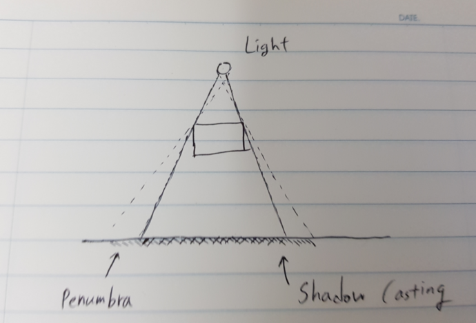
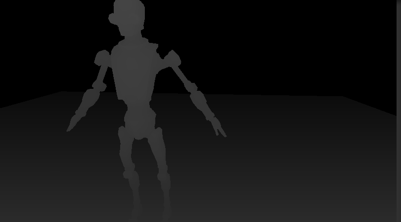
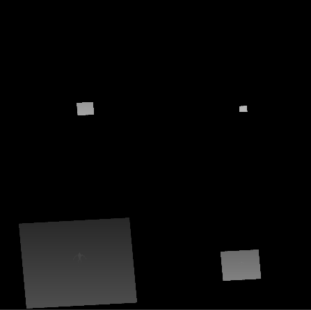
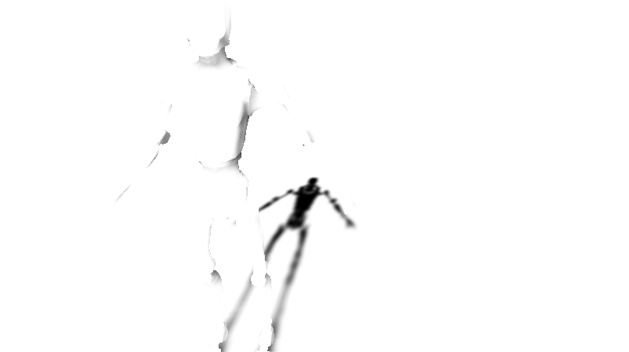
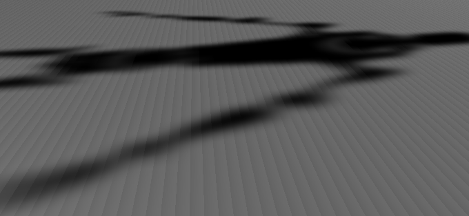

# Abstract

그림자를 만들어보자

# Shader

```c
Shader "UnityShaderTutorial/shadow_caster" {
	Properties {
		_MainTex("Texture", 2D) = "white" {}
	}
    SubShader {
        Pass {
            Tags {"LightMode"="ForwardBase"}
            CGPROGRAM
            #pragma vertex vert
            #pragma fragment frag
            #include "UnityCG.cginc"
			#include "UnityLightingCommon.cginc"
            struct v2f {
				float2 uv : TEXCOORD0;
                fixed4 diff : COLOR0;
                float4 vertex : SV_POSITION;
            };
            v2f vert (appdata_base v) {
                v2f o;
                o.vertex = UnityObjectToClipPos(v.vertex);
				o.uv = v.texcoord;
                half3 worldNormal = UnityObjectToWorldNormal(v.normal);
				half nl = max(0, dot(worldNormal, _WorldSpaceLightPos0.xyz));
				o.diff = nl * _LightColor0;
                // only evaluate ambient
				o.diff.rgb += ShadeSH9(half4(worldNormal, 1));

                return o;
            }

			sampler2D _MainTex;
            fixed4 frag (v2f i) : SV_Target {
				fixed4 col = tex2D(_MainTex, i.uv);
				col *= i.diff;
                return col;
            }
            ENDCG
        }

        // shadow caster rendering pass, implemented manually
        // using macros from UnityCG.cginc
        Pass
        {
            Tags {"LightMode"="ShadowCaster"}

            CGPROGRAM
            #pragma vertex vert
            #pragma fragment frag
            #pragma multi_compile_shadowcaster
            #include "UnityCG.cginc"

            struct v2f { 
                V2F_SHADOW_CASTER;
            };

            v2f vert(appdata_base v)
            {
                v2f o;
                TRANSFER_SHADOW_CASTER_NORMALOFFSET(o)
                return o;
            }

            float4 frag(v2f i) : SV_Target
            {
                SHADOW_CASTER_FRAGMENT(i)
            }
            ENDCG
        }
    }
}
```

# Description

위의 코드는 물체에 가려지는 부분을 다른 물체의 표면에 표현하도록 만들어준다.

물체가 광원과 다른 물체 사이에 놓이면 광원에서 뻗어져 나오는 광선의 일부 또는 전부가 다른 물체에 도달하는 것을 막는다. 다른 물체에는 광선이 도달하지 못하므로 부분적으로 빛을 받지 못하게 된다. 이 현상을 물체가 다른 물체에 그림자를 캐스팅 했다고 말한다.(shadow casting)

실제로 광원은 크기가 있기 때문에 완전히 차폐되지 못하고 일부분만 차폐되는 현상이 발생한다. 이 부분을 반투명 영역(`penumbra`)이라고 한다. 이 부분은 광원의 크기가 커질수록, 그림자가 캐스팅되는 표면이 물체에서 멀어질 수록 커진다. 하지만 유니티는 이 부분을 지원하지 않는다.



유니티에서 그림자를 캐스팅하려면 먼저 Quality Setting에서 Shadows 옵션을 설정해 주어야 한다. 여기서 그림자의 여부, 그림자의 품질을 지정할 수 있다. 그리고 Directional Light Inspector에서 Shadow Type을 설정해 주어야 한다. 또한 그림자를 캐스팅하는 물체의 Mesh Renderer 에도 Shadow Casting이라는 옵션이 있는데, 이를 On으로 설정해야 한다.


물체의 표면에 그림자가 캐스팅되는지 판단하는 방법은 간단하다. 광원에서 나온 광선이 해당 프래그먼트에 도달하는지 확인하면 된다. 하지만 모든 프래그먼트와 라이트를 계산하는 것은 매우 비현실적이기 때문에 유니티는 `Shadow Mapping`이라는 기법을 사용한다. 이 기법은 깊이 정보를 가지고 있는 화면의 크기와 동일한 텍스쳐를 만들어 차폐의 여부를 판단한다.

유니티는 그림자가 활성화되면 `depth pass`를 통해 카메라가 바라보는 장면의 깊이 정보를 저장한다. 해당 데이터는 clip space의 z좌표와 같다. 데이터는 0 ~ 1의 값으로 저장된다.



다음으로 유니티는 shadow map을 생성한다. 이는 depth_texture와 동일한 형식으로 값을 저장하지만, 광원의 시점에서 만들어진 데이터를 저장한다. 아래의 그림에서, 전체 장면이 네 번 렌더링 되는데, 이는 quality setting의 shadow cascade 옵션이 four cascades로 되어있기 때문이다. 옵션을 끄면 한번만 렌더링된다.



카메라 시점에서의 깊이 정보와 광원 시점에서의 깊이 정보를 가지고 있으면 좌표 변환을 통해 두 공간에서의 깊이 값을 비교할 수 있다. 광원 시점에서의 공간에서 보이지 않는 부분의 벡터를 좌표 변환하여 카메라 시점으로 변경했을 때, depth test를 통과하면 해당 부분은 그림자가 캐스팅 된다. 유니티는 이러한 작업을 반복하여 두 텍스쳐를 하나로 합친 `Screen-space Shadow Map`을 만든다. 이 텍스쳐는 화면에 표시될 최종 그림자들의 정보를 가지고 있다. 그림자로 표현될 부분은 0, 나머지는 1의 값을 가지게 된다.



이후 렌더링되는 모든 물체들은 해당 맵을 가지고 샘플링을 하게 된다.

실제 렌더링 되는 물체의 표면과 shadow map이 표현하는 텍셀의 크기가 다르면 표면에 그림자가 계단처럼 생기는 것을 볼 수 있다. shadow map의 텍셀이 단일 점이 아니기 때문에 상대적으로 넓은 지역을 덮게 되는데, 해당 텍셀이 광원의 방향을 기준으로 표면에 매핑되기 때문에 텍셀의 일부가 표면 밖으로 튀어나와서 생기는 현상이다. 이를 `Shadow Acne`라고 부른다.



해당 현상은 `bias` 오프셋을 추가하는 것으로 해결할 수 있다. shadow map을 매핑할 때 광원과의 거리에 약간의 값을 추가하여 텍셀의 튀어나온 부분이 표면안으로 들어가도록 하는 것이다. bias 값이 너무 커지면 물체와 그림자가 떨어져 보이는 `Peter Panning` 현상이 발생하기 때문에 적절한 조절이 필요하다.


이제 코드를 분석해보자. 위의 코드는 두 개의 pass로 이루어져 있다. 첫번째 pass는 현재 물체를 그리는 pass이고 두번째 pass는 그림자를 그리는 pass이다. 다음과 같은 태그가 선언되어야 한다.

```
Tags {"LightMode"="ShadowCaster"}
```

전처리 매크로에 다음과 같이 선언되어 있다. 이는 일반 directional light, spot light로 만들어지는 그림자와 point light 로 만들어지는 그림자가 다른 셰이더 코드를 사용하기 때문이다.

```
#pragma multi_compile_shadowcaster
```

vertex shader와 fragment shader 에는 각각 함수 한 줄씩 존재한다. 해당 함수들의 정의는 아래와 같다.

```c
#define TRANSFER_SHADOW_CASTER_NORMALOFFSET(o) TRANSFER_SHADOW_CASTER_NOPOS(o,o.pos)

#if defined(SHADOWS_CUBE) && !defined(SHADOWS_CUBE_IN_DEPTH_TEX)
    // Rendering into point light (cubemap) shadows
    #define TRANSFER_SHADOW_CASTER_NOPOS(o,opos) o.vec = mul(unity_ObjectToWorld, v.vertex).xyz - _LightPositionRange.xyz; opos = UnityObjectToClipPos(v.vertex);
    #define SHADOW_CASTER_FRAGMENT(i) return UnityEncodeCubeShadowDepth ((length(i.vec) + unity_LightShadowBias.x) * _LightPositionRange.w);

#else
    // Rendering into directional or spot light shadows
    #define V2F_SHADOW_CASTER_NOPOS
    // Let embedding code know that V2F_SHADOW_CASTER_NOPOS is empty; so that it can workaround
    // empty structs that could possibly be produced.
    #define V2F_SHADOW_CASTER_NOPOS_IS_EMPTY
    #define TRANSFER_SHADOW_CASTER_NOPOS(o,opos) \
        opos = UnityClipSpaceShadowCasterPos(v.vertex, v.normal); \
        opos = UnityApplyLinearShadowBias(opos);
    #define SHADOW_CASTER_FRAGMENT(i) return 0;
#endif
```

위의 함수는 `SHADOWS_CUBE`가 선언되어 있는지의 여부에 따라 처리가 달라진다. 위의 조건은 point light의 경우이고, 아래의 조건은 directional, spot light의 경우이다.

point light는 전방향으로 빛나기 때문에 SHADOWS_CUBE 옵션을 사용하며 그림자를 구하는 방법이 위에서 봤던  shadow map과 다르다. vertex shader에서 광원까지의 벡터를 구해서 fragment shader에서 shadow cube와 비교하여 차폐여부를 결정한다.

directinal light, spot light는 vertex shader에서 bias 계산을 하고 fragment shader 에서는 아무 일도 하지 않는다. 아래의 함수는 normal bias를 적용하는 함수이다.

```c
float4 UnityClipSpaceShadowCasterPos(float4 vertex, float3 normal) {
    float4 wPos = mul(unity_ObjectToWorld, vertex);

    if (unity_LightShadowBias.z != 0.0) {
        float3 wNormal = UnityObjectToWorldNormal(normal);
        float3 wLight = normalize(UnityWorldSpaceLightDir(wPos.xyz));

        // apply normal offset bias (inset position along the normal)
        // bias needs to be scaled by sine between normal and light direction
        // (http://the-witness.net/news/2013/09/shadow-mapping-summary-part-1/)
        //
        // unity_LightShadowBias.z contains user-specified normal offset amount
        // scaled by world space texel size.

        float shadowCos = dot(wNormal, wLight);
        float shadowSine = sqrt(1-shadowCos*shadowCos);
        float normalBias = unity_LightShadowBias.z * shadowSine;

        wPos.xyz -= wNormal * normalBias;
    }

    return mul(UNITY_MATRIX_VP, wPos);
}
```

아래는 bias 값을 적용하는 함수이다. z값에 bias로 지정한 값을 더한 뒤 lerp 함수로 조절을 한다.

```c
float4 UnityApplyLinearShadowBias(float4 clipPos) {
#if defined(UNITY_REVERSED_Z)
#   if !(defined(SHADOWS_CUBE) && defined(SHADOWS_CUBE_IN_DEPTH_TEX))
    // We use max/min instead of clamp to ensure proper handling of the rare case
    // where both numerator and denominator are zero and the fraction becomes NaN.
    clipPos.z += max(-1, min(unity_LightShadowBias.x / clipPos.w, 0));
#   endif
    float clamped = min(clipPos.z, clipPos.w*UNITY_NEAR_CLIP_VALUE);
#else
    clipPos.z += saturate(unity_LightShadowBias.x/clipPos.w);
    float clamped = max(clipPos.z, clipPos.w*UNITY_NEAR_CLIP_VALUE);
#endif
    clipPos.z = lerp(clipPos.z, clamped, unity_LightShadowBias.y);
    return clipPos;
}
```

# References

* https://catlikecoding.com/unity/tutorials/rendering/part-7/
* https://learnopengl.com/Advanced-Lighting/Shadows/Shadow-Mapping