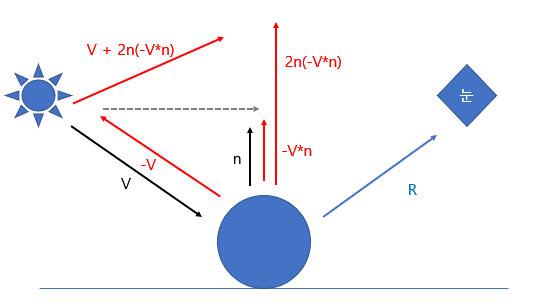

# Abstract

물체의 표면에 스카이맵이 반사된 모습을 표현합니다.

# Shader

```c
// Upgrade NOTE: replaced '_Object2World' with 'unity_ObjectToWorld'

Shader "UnityShaderTutorial/skymap_reflect" {
    SubShader
    {
        Pass
        {
            CGPROGRAM
            #pragma vertex vert
            #pragma fragment frag
            #include "UnityCG.cginc"

            struct v2f {
                half3 worldRefl : TEXCOORD0;
                float4 pos : SV_POSITION;
            };

            v2f vert (float4 vertex : POSITION, float3 normal : NORMAL)
            {
                v2f o;
                o.pos = UnityObjectToClipPos(vertex);
                // compute world space position of the vertex
                float3 worldPos = mul(unity_ObjectToWorld, vertex).xyz;
                // compute world space view direction
                float3 worldViewDir = normalize(UnityWorldSpaceViewDir(worldPos));
                // world space normal
                float3 worldNormal = UnityObjectToWorldNormal(normal);
                // world space reflection vector
                o.worldRefl = reflect(-worldViewDir, worldNormal);
                return o;
            }
        
            fixed4 frag (v2f i) : SV_Target
            {
                // sample the default reflection cubemap, using the reflection vector
                half4 skyData = UNITY_SAMPLE_TEXCUBE(unity_SpecCube0, i.worldRefl);
                // decode cubemap data into actual color
                half3 skyColor = DecodeHDR (skyData, unity_SpecCube0_HDR);
                // output it!
                fixed4 c = 0;
                c.rgb = skyColor;
                return c;
            }
            ENDCG
        }
    }
}
```

# Description

물체의 표면에 반사를 표현하기 위해서는 물체 주변의 모든 방향에 대해서 반사되는 부분을 구해야 합니다.<br>

반사 벡터를 구하기 위해 월드 좌표상의 위치와 노말 벡터를 구하고, 카메라 위치에서 오브젝트를 향하는 벡터와 노말 벡터를 이용하여 반사 벡터를 구합니다.

```
// 월드 좌표상의 위치
float3 worldPos = mul(unity_ObjectToWorld, vertex).xyz;
// 카메라 위치에서 오브젝트를 향하는 방향 벡터
float3 worldViewDir = normalize(UnityWorldSpaceViewDir(worldPos));
// 월드 좌표상의 노말 벡터
float3 worldNormal = UnityObjectToWorldNormal(normal);
// 반사 벡터
o.worldRefl = reflect(-worldViewDir, worldNormal);
```

유니티에서는 씬에서 반사 소스로 스카이박스(스카이맵)가 사용될 때 이 스카이박스 데이터를 담고 있는 디폴트 반사 텍스쳐(반사 프로브)가 반드시 생성됩니다. 또한 이를 사전 정의 해놓았습니다.

```
unity_SpecCube0 : 사용중인 반사 프로브의 데이터를 포함하고 있는 큐브맵
```

`UNITY_SAMPLE_TEXCUBE` 라는 빌트인 매크로를 사용하여 
텍셀을 얻어오고, 큐브맵에는 HDR 색상이 포함되어 있기 때문에 HDR 형식에서 RGB 형식으로 변환하여 사용해야합니다.

## Reflect

```
reflect(i, n) : 입사 광선과 표면 법선을 사용하여 반사 벡터를 반환

i : 입사광의 방향 벡터
n : 반사면의 표면 법선
```

reflect() 함수는 HLSL 함수로위의 함수로 반사 벡터를 구한 뒤 해당 벡터를 스카이맵의 텍셀을 얻어오는 좌표로 사용합니다.



V : 입사광의 벡터, R : 반사 벡터, n : 법선 벡터

1. 입사광의 벡터인 V와 현재 물체의 법선 벡터인 n을 내적하여 -V의 n의 방향으로의 크기(내적값)를 구한다. => -V * n
2. 내적값은 스칼라이므로 n을 곱하여 벡터를 만든다. => n(-V * n)
3. 2번에서 만든 벡터의 크기를 2배로 늘린다. => 2n(-V * n)
4. 3번의 벡터에 입사광의 벡터인 V를 더한다. => V + 2n(-V * n)

# Prerequisites