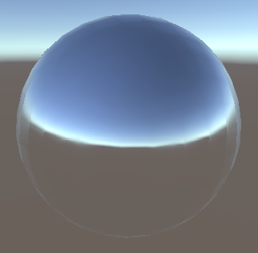

# Abstract

서피스 쉐이더를 이용하여 물체의 표면에 큐브맵이 반사된 모습을 표현.

# Shader

```c
Shader "UnityShaderTutorial/surface_shader_cubemap_reflection" {
	Properties {
      _Cube ("Cubemap", CUBE) = "" {}
    }

    SubShader {
      Tags { "RenderType" = "Opaque" }

      CGPROGRAM
      #pragma surface surf Lambert

      struct Input {
          float3 worldRefl;
      };

      samplerCUBE _Cube;

      void surf (Input IN, inout SurfaceOutput o) {
          o.Emission = texCUBE (_Cube, IN.worldRefl).rgb;
      }
      ENDCG
    } 
    Fallback "Diffuse"
}
```

# Description

프로퍼티로 받은 큐브맵 정보와 월드좌표계상의 반사벡터값을 이용하여 색을 표현한다.

