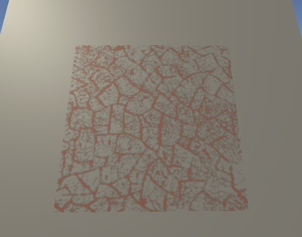

# Abstract

서피스 쉐이더를 이용하여 데칼을 표현해보자.

# Shader

```c
Shader "UnityShaderTutorial/surface_shader_decals" {
	Properties {
    	_MainTex ("Base (RGB)", 2D) = "white" {}
	}

  	SubShader {
    	Tags { "RenderType"="Opaque" "Queue"="Geometry+1" "ForceNoShadowCasting"="True" }
    
    	CGPROGRAM
	    #pragma surface surf Lambert decal:blend
	    
	    sampler2D _MainTex;
	    
	    struct Input {
	      float2 uv_MainTex;
	    };
	    
	    void surf (Input IN, inout SurfaceOutput o) {
	        half4 c = tex2D (_MainTex, IN.uv_MainTex);
	        o.Albedo = c.rgb;
	        o.Alpha = c.a;
	      }
	    ENDCG
    }
}
```

# Description

`Queue=Geometry+1`

```
불투명한 오브젝트를 먼저 그리고 투명한 물체중에는 가장먼저 그리겠다는 의미.
```

`ForceNoShadowCasting=True`

```
오브젝트에 그림자가 투영되지 않도록 하겠다는 의미.
```

`decal:blend`

```
반투명한 데칼을 사용하고 싶을때 선언.
```


