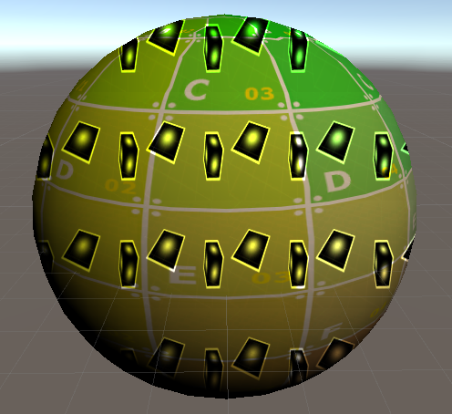

# Abstract

서피스 셰이더 - 스크린 공간의 디테일 텍스처에 대해 알아봅니다.

# Shader

```c
Shader "UnityShaderTutorial/surface_shader_detail_texture_in_screen_space" {
    Properties{
        _MainTex("Texture", 2D) = "white" {}
        _Detail("Detail", 2D) = "gray" {}
    }

    SubShader{
        Tags { "RenderType" = "Opaque" }

        CGPROGRAM
        #pragma surface surf Lambert

        struct Input {
            float2 uv_MainTex;
            float4 screenPos;
        };

        sampler2D _MainTex;
        sampler2D _Detail;

        void surf(Input IN, inout SurfaceOutput o) {
            o.Albedo = tex2D(_MainTex, IN.uv_MainTex).rgb;
            float2 screenUV = IN.screenPos.xy / IN.screenPos.w;
            screenUV *= float2(8,6);
            o.Albedo *= tex2D(_Detail, screenUV).rgb * 2;
        }
        ENDCG
    }
    Fallback "Diffuse"
}
```

# Description

서피스 쉐이더에서 스크린 공간, `screenPos`가 어떻게 사용되는지를 알아봅니다.

```
float2 screenUV = IN.screenPos.xy / IN.screenPos.w;
screenUV *= float2(8,6);
o.Albedo *= tex2D(_Detail, screenUV).rgb * 2;
```

## 결과

