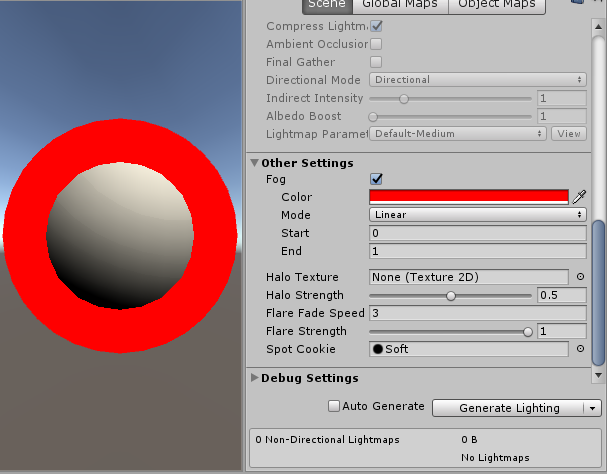

# Abstract

서피스 쉐이더에서 선형 Fog를 적용해 보자

# Shader

```c
Shader "UnityShaderTutorial/surface_shader_linearfog" {
	Properties {
    _MainTex ("Base (RGB)", 2D) = "white" {}
  }
  SubShader {
    Tags { "RenderType"="Opaque" }
    LOD 200
    
    CGPROGRAM
    #pragma surface surf Lambert finalcolor:mycolor vertex:myvert
    #pragma multi_compile_fog

    sampler2D _MainTex;
    uniform half4 unity_FogStart;
    uniform half4 unity_FogEnd;

    struct Input {
      float2 uv_MainTex;
      half fog;
    };

    void myvert (inout appdata_full v, out Input data) {
      UNITY_INITIALIZE_OUTPUT(Input,data);
      float pos = length(UnityObjectToViewPos(v.vertex).xyz);
      float diff = unity_FogEnd.x - unity_FogStart.x;
      float invDiff = 1.0f / diff;
      float fogbypos = (unity_FogEnd.x - pos) * invDiff;
      data.fog = clamp (fogbypos, 0.0, 1.0);
    }
    void mycolor (Input IN, SurfaceOutput o, inout fixed4 color) {
      #ifdef UNITY_PASS_FORWARDADD
        UNITY_APPLY_FOG_COLOR(IN.fog, color, float4(0,0,0,0));
      #else
        UNITY_APPLY_FOG_COLOR(IN.fog, color, unity_FogColor);
      #endif
    }

    void surf (Input IN, inout SurfaceOutput o) {
      half4 c = tex2D (_MainTex, IN.uv_MainTex);
      o.Albedo = c.rgb;
      o.Alpha = c.a;
    }
    ENDCG
  } 
  FallBack "Diffuse"
}
```

# Description

위 쉐이더 코드를 적용했을때 결과물과 LightingSetting은 아래와 같다.



각 `Vertex`의 `ViewSpace`에서의 거리에 따라 `Fog Color` 적용 여부가 결정된다.

아래 코드를 이용해서 각 `Vertex`의 거리를 구한다.

```
float pos = length(UnityObjectToViewPos(v.vertex).xyz);
```

그리고, [선형 보간 법칙](https://ko.wikipedia.org/wiki/%EC%84%A0%ED%98%95_%EB%B3%B4%EA%B0%84%EB%B2%95) 을 이용해서 `Fog`의 적용 정도를 구한다. 코드는 아래와 같다.

```
float diff = unity_FogEnd.x - unity_FogStart.x;
float invDiff = 1.0f / diff;
float fogbypos = (unity_FogEnd.x - pos) * invDiff;
```

`Fog`의 적용 정도 값은 0에서 1값으로 사용되기 때문에 보간을 해준다.

```
data.fog = clamp ((unity_FogEnd.x - pos) * invDiff, 0.0, 1.0);
```
