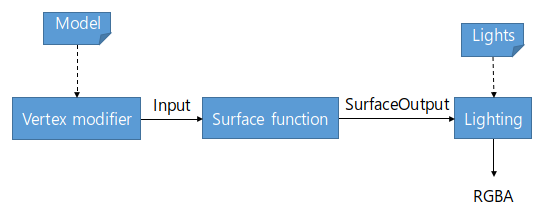
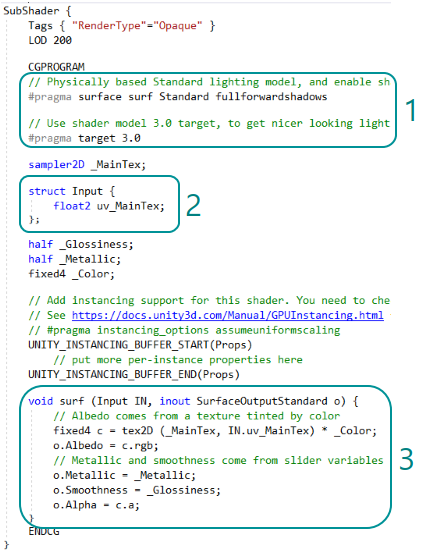

# Abstract

서피스 셰이더에 대해 알아봅니다.

# Shader

```c
Shader "UnityShaderTutorial/surface_shader_simple" {
	Properties {
		_Color ("Color", Color) = (1,1,1,1)
		_MainTex ("Albedo (RGB)", 2D) = "white" {}
		_Glossiness ("Smoothness", Range(0,1)) = 0.5
		_Metallic ("Metallic", Range(0,1)) = 0.0
	}
	SubShader {
		Tags { "RenderType"="Opaque" }
		LOD 200

		CGPROGRAM
		// Physically based Standard lighting model, and enable shadows on all light types
		#pragma surface surf Standard fullforwardshadows

		// Use shader model 3.0 target, to get nicer looking lighting
		#pragma target 3.0

		sampler2D _MainTex;

		struct Input {
			float2 uv_MainTex;
		};

		half _Glossiness;
		half _Metallic;
		fixed4 _Color;

		// Add instancing support for this shader. You need to check 'Enable Instancing' on materials that use the shader.
		// See https://docs.unity3d.com/Manual/GPUInstancing.html for more information about instancing.
		// #pragma instancing_options assumeuniformscaling
		UNITY_INSTANCING_BUFFER_START(Props)
			// put more per-instance properties here
		UNITY_INSTANCING_BUFFER_END(Props)

		void surf (Input IN, inout SurfaceOutputStandard o) {
			// Albedo comes from a texture tinted by color
			fixed4 c = tex2D (_MainTex, IN.uv_MainTex) * _Color;
			o.Albedo = c.rgb;
			// Metallic and smoothness come from slider variables
			o.Metallic = _Metallic;
			o.Smoothness = _Glossiness;
			o.Alpha = c.a;
		}
		ENDCG
	}
	FallBack "Diffuse"
}
```

# Description

서피스 셰이더는 `vertex` 나 `fragment` 쉐이더를 사용하는 것 보다 더 쉽게 작성할 수 있게 해주는 쉐이더입니다.

즉, 위의 두 쉐이더를 정해진 데이터 구조에 값을 채워넣기만 하면 컴파일러가 코드를 알아서 생성합니다.

아래의 그림은 서피스 쉐이더가 어떻게 동작하는지 간략하게 보여주고 있습니다.



# 구조



유니티에서 서피스 쉐이더를 만들면 기본적으로 들어있는 코드들입니다.
다른 쉐이더와 마찬가지로 CGPROGRAM ... ENDCG 내에 위치합니다.

3부분으로 나누어서 살펴보겠습니다.

## 1. 설정 부분

서피스 쉐이더의 전처리 부분으로 쉐이더의 조명 계산 모델이나 기타 세부적인 분기를 정해주는 부분입니다.

`#pragma surface ...` 로 이 쉐이더가 서피스 쉐이더임을 알립니다.
또한 기존 쉐이더와는 다르게 `Pass`가 아닌 `SubShader` 내에 위치합니다.

### 서피스 쉐이더 컴파일 지시문

```
#pragma surface surfaceFunction lightModel [optionalparams]
ex) #pragma surface surf Lambert
```

#### SurfaceFunction

서피스 쉐이더 코드가 있는 함수이름 입니다. 해당 함수는 `void surf(Input IN, inout SurfaceOutput o)`의 형식이여야 합니다.

#### LightModel

유니티에서 지원하는 조명 모델로는
* Standard
* StandardSpecular
* Lambert or BlinnPhong

이렇게 4가지가 있습니다. `Standard, StandardSpecular`는 물리기반 조명 모델입니다.

위의 예제 구문을 해석하자면 "해당 쉐이더를 위한 서피스 함수 이름은 `surf` 이고, 조명 모델로 `Lambert` 조명 모델을 사용할 것 이다." 입니다.

기타 optionalparams는 유니티의 [서피스 쉐이더 매뉴얼](https://docs.unity3d.com/kr/current/Manual/SL-SurfaceShaders.html)을 참조합니다.

## 2. 입력 부분

모델의 데이터를 가져오는 부분입니다. 필요한 데이터들을 `Input` 구조체 안에 선언하면 서피스 함수 내에서 사용이 가능합니다.

`Input` 에는 일반적으로 쉐이더가 필요로하는 텍스처 uv 좌표가 있습니다. 텍스처 좌표의 변수 이름은 이름 앞에 `uv`가 붙는 형식으로 작성해야 합니다.

```
sampler2D _Texture;
struct Input {
	float2 uv_Texture;
}
```

그 밖에도 모델의 월드좌표, 월드법선 등 변수를 추가하기만 하면 유니티가 계산한 값들로 채울 수 있습니다. 지원하는 변수 목록은 유니티의 [서피스 쉐이더 매뉴얼](https://docs.unity3d.com/kr/current/Manual/SL-SurfaceShaders.html)을 참조합니다.

## 3. 함수 부분

실직적으로 코드를 작성하여 모델의 최종 모습을 결정합니다. 그러기 위해선 `SurfaceOutput` 이라는 서피스 쉐이더의 출력구조에 값을 채워줘야 합니다.

### 서피스 쉐이더 표준 출력 구조

```
struct SurfaceOutput
{
    fixed3 Albedo;  // diffuse color
    fixed3 Normal;  // tangent space normal, if written
    fixed3 Emission;
    half Specular;  // specular power in 0..1 range
    fixed Gloss;    // specular intensity
    fixed Alpha;    // alpha for transparencies
};
```

위의 출력 구조는 물리 기반 조명 모델이 아닐경우에 사용하는 출력 구조입니다.
조명 모델을 `Standard, StandardSpecular` 로 사용할 경우 다른 출력 구조를 사용해서 값을 채워줘야 합니다. 해당 출력 구조는 유니티의 [서피스 쉐이더 매뉴얼](https://docs.unity3d.com/kr/current/Manual/SL-SurfaceShaders.html)을 참조합니다.