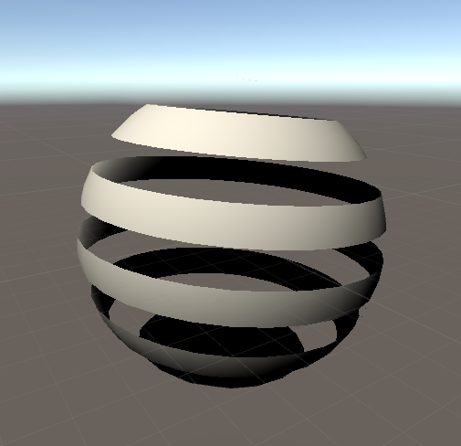
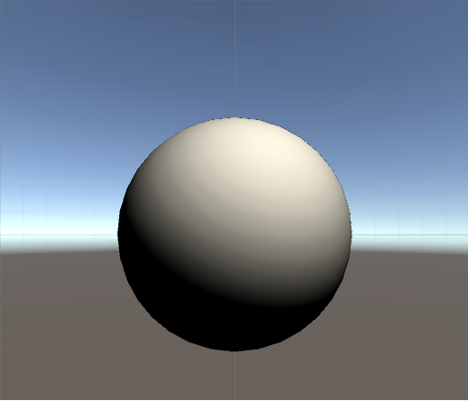
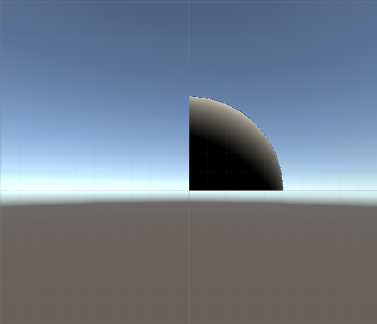
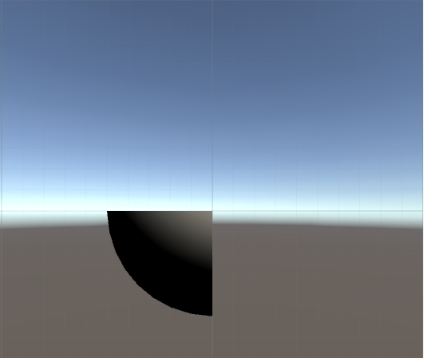

# Abstract

서피스 쉐이더를 이용하여 물체를 잘라보자

# Shader

```c
Shader "UnityShaderTutorial/surface_shader_slices" {
	 Properties {
      _MainTex ("Texture", 2D) = "white" {}
      _BumpMap ("Bumpmap", 2D) = "bump" {}
    }
    SubShader {
      Tags { "RenderType" = "Opaque" }
      
	  Cull Off
      
	  CGPROGRAM
      
	  #pragma surface surf Lambert
      
	  struct Input {
          float2 uv_MainTex;
          float2 uv_BumpMap;
          float3 worldPos;
      };
      
	  sampler2D _MainTex;
      sampler2D _BumpMap;
      
	  void surf (Input IN, inout SurfaceOutput o) {
		  clip (frac((IN.worldPos.y+IN.worldPos.z*0.1) * 5) - 0.5);
          o.Albedo = tex2D (_MainTex, IN.uv_MainTex).rgb;
          o.Normal = UnpackNormal (tex2D (_BumpMap, IN.uv_BumpMap));
      }
      
	  ENDCG
    } 
    Fallback "Diffuse"
}
```

# Description




아래 코드를 이용해서 물체를 자른것 처럼 표현 할 수 있다.

```
clip (frac((IN.worldPos.y+IN.worldPos.z*0.1) * 5) - 0.5);
```

`frac(float x)` 함수는 소수 `x`의 가수 부분, 즉 소수점 이하 부분을 리턴 한다. 예를 들어 아래와 같은 결과를 얻을 수 있다.

* frac(0.5) = 0.5
* frac(1.5) = 0.5
* frac(1.75) = 0.75
* frac(100.75) = 0.75

`clip([float | float2 | float3] x)` 함수는 파라미터 `x`가 0보다 작을 때 그리는 행위를 하지 않는다. 아래의 예시 처럼 동작된다.

| original | clip(IN.worldPos) | clip(-IN.worldPos) | 
|:-------:|:--------:|:--------:|
|  |  |  |


