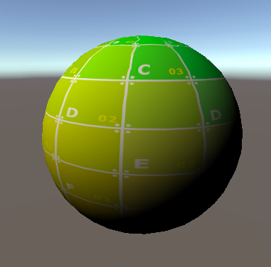

# Abstract

서피스 쉐이더를 이용하여 텍스처를 적용해 보자.

# Shader

```c
Shader "UnityShaderTutorial/surface_shader_texture" {
	Properties {
      _MainTex ("Texture", 2D) = "white" {}
    }

    SubShader {
      Tags { "RenderType" = "Opaque" }

      CGPROGRAM
      #pragma surface surf Lambert

      struct Input {
          float2 uv_MainTex;
      };

      sampler2D _MainTex;

      void surf (Input IN, inout SurfaceOutput o) {
          o.Albedo = tex2D (_MainTex, IN.uv_MainTex).rgb;
      }
      ENDCG
    } 
    Fallback "Diffuse"
}
```

# Description

surface로 사용 할 함수(surf)와 조명 모델(Lambert)을 선언한다.

surf 함수에서는 프로퍼티로 넘겨받은 텍스처와 오브젝트의 UV 값을 이용하여 Albedo의 색상을 채운다.



# Prerequisites

## surface 선언 방법

`#pragma surface surfaceFunction lightModel [optionalparams]`

### surfaceFunction

```
surface로 사용 할 함수의 이름.

ex) void surf(Input IN, inout SurfaceOutput o){};
```

### lightModel

```
사용할 조명 모델.

* 종류

물리 기반의 Standard 및 StandardSpecular.
물리 기반이 아닌 단순한 Lambert (디퓨즈) 및 BlinnPhong (스페큘러).
```
```
struct SurfaceOutputStandard {
    fixed3 Albedo;      // base (diffuse or specular) color
    fixed3 Normal;      // tangent space normal, if written
    half3 Emission;
    half Metallic;      // 0=non-metal, 1=metal
    half Smoothness;    // 0=rough, 1=smooth
    half Occlusion;     // occlusion (default 1)
    fixed Alpha;        // alpha for transparencies
};

struct SurfaceOutputStandardSpecular {
    fixed3 Albedo;      // diffuse color
    fixed3 Specular;    // specular color
    fixed3 Normal;      // tangent space normal, if written
    half3 Emission;
    half Smoothness;    // 0=rough, 1=smooth
    half Occlusion;     // occlusion (default 1)
    fixed Alpha;        // alpha for transparencies
};
```

```
Lambert

가장 기본적인 diffuse 라이팅 모델.

모든 방향에서 같은 복사량(흡수, 투과, 반사)을 취하게 된다는 가정을 깔고 있으며, 
플라스틱이나 모래와 같이 반들반들한 표면을 가진 재질에 적합.
```

```
BlinnPhong

???
```