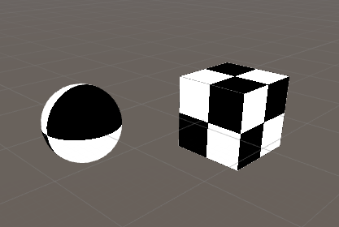
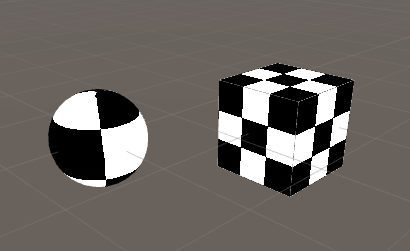

# Abstract

Vertex, Fragment Shader를 이용하여 물체에 텍스처를 입혀보자.

# Shader

```c
Shader "UnityShaderTutorial/texture"
{
    Properties {
        _Range ("Range", Range(2,50)) = 30
    }

    SubShader {
        Pass {
            CGPROGRAM
            #pragma vertex vert
            #pragma fragment frag

            struct v2f {
                float2 uv : TEXCOORD0;
                float4 vertex : SV_POSITION;
            };

            float _Range;

            v2f vert (float4 pos : POSITION, float2 uv : TEXCOORD0) {
                v2f o;
                o.vertex = UnityObjectToClipPos(pos);
                o.uv = uv * _Range;
                return o;
            }
            
            fixed4 frag (v2f i) : SV_Target {
                float2 c = i.uv;
                c = floor(c) / 2;
                float checker = frac(c.x + c.y) * 2;
                return checker;
            }
            ENDCG
        }
    }
}
```

# Description

Range의 범위를 설정하여 텍스처가 맵핑되는 범위를 설정한다.

_Range에 30의 값이 들어가있다고 가정할때,

하나의 메쉬에 30개의 텍스처가 들어가게되고 각 프레그먼트의 uv좌표값으로

(0,1), (0,2), (0,3)...(0,30)이 들어가 있다.

frag 함수에서 계산식을 봤을때 

`float2 c = i.uv`에서 i.uv에는 (0, 1), (0, 2), (0, 3)등이 들어가 있고,

`c = floor(c) / 2`에서 floor(c) / 2를 계산한 값에는 (0, 0.5), (0, 1), (0, 1.5)등이 들어간다.

`float checker = frac(c.x + c.y) * 2`에서 frac(c.x + c.y) * 2 한 값에는 (0 + 0.5) * 2 , (0 + 1) * 2 를 한 값으로 0 또는 1이 나오게된다.

결국 0 또는 1, 검은색 또는 흰색으로 값을 반환하여 체크무늬처럼 보이게된다.

# Prerequisites

`HLSL의 내장함수`

```
frac : 소수점 이하 부분을 리턴한다.
floor : 내림한 정수를 리턴한다. 
```

`uv 좌표계는 (0,0) ~ (1,0)로 설정`이 된다.

마지막 uv의 좌표가 (1,0)일때 정확하게 하나의 텍스처가 붙게되고, 숫자가 증가하게 되면 여러개의 텍스처가 중복하여 붙게된다.

`Range가 2일때`



`Range가 3일때`


