# Abstract 

변환에 대해 정리한다.

# 선형변환

변환을 의미하는 함수를 `\tau` 라고 했을 때 그 함수가 다음과 같은 두가지 성질을 만족하면 선형변환이라고 한다. `u`, `v` 는 벡터이고 `k` 는 스칼라이다.


```latex
\begin{aligned} 
\tau(u + v) &= \tau(u) + \tau(t) \\
\tau(ku)  &= k\tau(u) \\
\end{aligned}
```

컴퓨터로 선형변환을 구현하기 위해서는 행렬의 곱연산이 필요하다. 그리고 그 행렬은 다음과 같이 제작한다.

`u = (x, y, z)` 라 할 때 좌표축을 나타내는 벡터 `i, j, k` 를 이용하여 
다음과 같이 표현해보자. 벡터 `i, j, k` 는 삼차원 공간에서 `x, y, z` 축과 같은 방향의 단위벡터로 표준기저벡터(standard basis vector)라고 부른다.


```latex
\begin{aligned}
u &= (x, y, z) \\
  &= xi + yj + zk \\
  &= x(1,0,0) + y(0,1,0) + z(0,0,1)
\end{aligned}
```

선형변환 `\tau` 에 벡터 `u` 를 입력으로 하면 다음과 같이 식을 전개할 수 있다. 결국 선형변환은 행렬 `A` 의 곱셈연산으로 표현 가능하다.


```latex
\begin{aligned}
\tau(u) &= \tau(xi + yj + zk) \\
       &= x\tau(i) + y\tau(j) + z\tau(k) \\
       &= uA \\
       &= [x,y,z]\begin{bmatrix} \leftarrow \tau(i) \rightarrow 
                 \\ \leftarrow \tau(j) \rightarrow 
                 \\ \leftarrow \tau(k) \rightarrow 
                 \end{bmatrix} \\
       &= [x,y,z]\begin{bmatrix} A_{11} & A_{12} & A_{13}
                 \\  A_{21} & A_{22} & A_{23} 
                 \\  A_{31} & A_{32} & A_{33}
                 \end{bmatrix} \\
\end{aligned} \\
```

예를 들어 벡터 `u` 에 행렬 `S` 를 곱셈하면 비례를 표현할 수 있다.

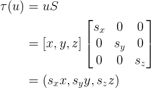

```latex
\begin{aligned} 
\tau (u) &= uS \\
         &= [x, y, z] \begin{bmatrix}
            s_{x} & 0 & 0\\ 
            0& s_{y} & 0\\ 
            0&  0& s_{z}
            \end{bmatrix} \\
         &= (s_{x}x,s_{y}y,s_{z}z) \\
\end{aligned}
```

예를 들어 벡터 `u` 에 행렬 `R_{x}` 을 곱셈하면 `x` 축을 기준으로 한 회전을 표현할 수 있고
`R_{y}` 을 곱셈하면 `y` 축을 기준으로 한 회전을 표현할 수 있고
`R_{z}` 을 곱셈하면 `z` 축을 기준으로 한 회전을 표현할 수 있다.

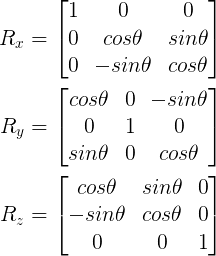

```latex
\begin{aligned}
R_{x} &= \begin{bmatrix}
         1 & 0 & 0\\ 
         0 & cos\theta & sin\theta\\ 
         0 & -sin\theta & cos\theta
         \end{bmatrix} \\
R_{y}    &= \begin{bmatrix}
            cos\theta & 0 & -sin\theta\\ 
            0 & 1 & 0\\ 
            sin\theta & 0 & cos\theta
            \end{bmatrix} \\
R_{z}    &= \begin{bmatrix}
            cos\theta & sin\theta & 0\\ 
            -sin\theta & cos\theta & 0\\ 
            0 & 0 & 1
            \end{bmatrix}
\end{aligned}
```

# 아핀변환

아핀변환(Affine Transformation)은 선형변환(Linear Transformation)에 위치변환(Translation)을 추가한 변환이다.

그러나 벡터는 위치변환의 영향을 받지 않는다. 벡터는 크기와 방향만으로 표현되기 때문이다. 따라서 위치변환은 점만 해당된다.
한편 구현을 위해서는 벡터와 점을 동일하게 취급해야 할 필요가 있다.
그래서 동차좌표(homogeneous coordinates)가 고안되었다.

3D 공간에서 동차좌표는 하나의 원소를 추가하여 표현한다. 마지막 원소가 0 이면 벡터를 의미하고 1이면 점을 의미한다. 예를 들어 `(x, y, z, 0)` 은 벡터를 의미하고 `(x, y, z, 1)` 은 점을 의미한다.

아핀변환을 `\alpha` 와 선형변환행렬 `A`, 이동변환벡터 `b` 를 이용하여 다음과 같이 표현해 보자.

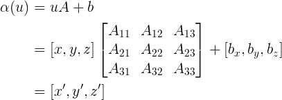

```latex
\begin{aligned} 
\\\alpha(u) &= uA+b \\
            &= [x,y,z]\begin{bmatrix} A_{11} & A_{12} & A_{13}
                      \\ A_{21} & A_{22} & A_{23} 
                      \\ A_{31} & A_{32} & A_{33}
                      \end{bmatrix}+[b_{x},b_{y},b_{z}] \\
            &=[x',y',z'] \\
            
\end{aligned} 
```

앞서 언급한 수식에 동차좌표가 도입되면 `u` 는 벡터 혹은 점이 가능하다.


```latex
\left[ x,y,z,1 \right]\begin{bmatrix}
                      A_{11} & A_{12} & A_{13} & 0\\ 
                      A_{21} & A_{22} & A_{23} & 0\\ 
                      A_{31} & A_{32} & A_{33} & 0\\ 
                      b_{x} & b_{y} & b_{z} & 1
                      \end{bmatrix} = [x',y',z',1]
```

아핀변환 `\alpha` 는 선형변환 `\tau` 와 벡터 `b` 를 이용하여 다음과 같이 표현할 수 있다.

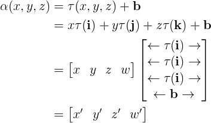

```latex
\begin{aligned}
\alpha(x, y, z) &= \tau(x, y, z) + \bold b \\
                &= x \tau(\bold i) + y \tau(\bold j) + z \tau(\bold k) + \bold b \\
                &= \begin{bmatrix}
                     x & y & z & w
                   \end{bmatrix} 
                   \begin{bmatrix}
                     \leftarrow \tau(\bold i) \rightarrow \\
                     \leftarrow \tau(\bold i) \rightarrow \\
                     \leftarrow \tau(\bold i) \rightarrow \\
                     \leftarrow \bold b \rightarrow \\
                   \end{bmatrix} \\
                &= \begin{bmatrix}
                     {x}' & {y}' & {z}' & {w}'
                   \end{bmatrix} 
\end{aligned}
```

위의 식을 잘 살펴 보면 아핀변환 `\alpha` 는 기저벡터 `i, j, k` 를 선형변환하고 벡터 `b` 를 덧셈연산한 것과 같음을 알 수 있다.

# 변환의 합성

행렬 `S` 는 스케일링변환, 행렬 `R` 는 회전변환, 행렬 `T` 는 이동변환을 의미한다고 하자. 8개의 버텍스로 구성된 큐브를 앞서 언급한 세가지 행렬을 곱셈연산하여 변환을 다음과 같이 구현할 수 있다. `(for i = 0, 1,..., 7)`


```latex
\begin{aligned}
((v_{i}S)R)T &= ({v_{i}}'R)T \\
             &= {v_{i}}''T \\
             &= {v_{i}}'''
\end{aligned}
```

위의 식을 잘 살펴보면 `SRT` 를 미리 구해놓고 이것을 행렬 `C` 라고 하면 행렬의 곱셈연산이 줄어들기 때문에 성능을 향상시킬 수 있다.

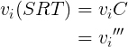

```latex
\begin{aligned}
v_{i}(SRT) &= v_{i}C \\
           &= {v_{i}}'''
\end{aligned}
```

# 좌표계의 변환

우리는 주로 섭씨 온도를 사용한다. 예를 들어 섭씨 온도 `100` 을 화씨 온도로 변환 하려면 어떻게 해야할까? 바로 다음과 같은 식을 이용하면 된다.

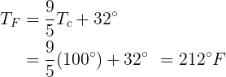

```latex
\begin {aligned} 
T_{F} &= \frac{9}{5} T_{c} + 32^{\circ} \\
      &= \frac{9}{5} (100^{\circ}) + 32^{\circ}
      &= 212^{\circ}F
\end{aligned}
```

유사한 방법으로 3D 공간의 벡터 혹은 점을 다른 좌표계에서 표현하는 방법을 알아보자.

먼저 벡터의 경우를 살펴보자. 예를 들어 2D 공간에서 A 좌표계를 기준으로 한 좌표 `P_A(x, y)` 를 B 좌표계를 기준으로 한 좌표 `P_B({x}',{y}')` 으로 표현해보자.

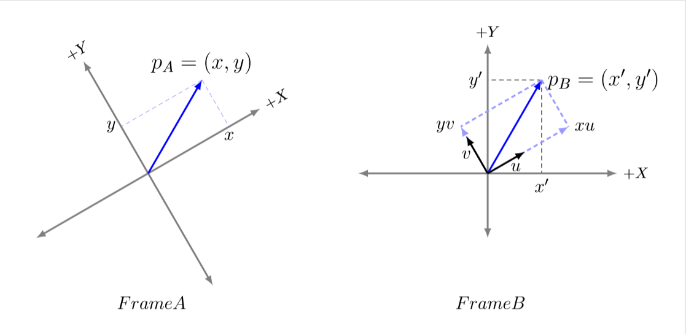

```latex
\documentclass[tikz,border=10pt]{standalone}

\usepackage{tikz}
\usepackage{rotating}

\usetikzlibrary{scopes}
\usetikzlibrary{intersections}
\usetikzlibrary{calc}

\begin{document}

\begin{tikzpicture}
    \def\rotangle{30}
    \def\angvalue{30}
    %\def\rad{3}
    %\def\x{2} \def\y{1.5}
	\tikzset{arrow_style/.style={>=latex,very thick}}
	
	\matrix[column sep=1cm] {
        \begin{turn}{\rotangle}
            \coordinate(PA) at (\angvalue:2.5 cm);
            \draw[densely dashed,blue!40]let \p{PA}=(PA) in (PA) -- (\x{PA},0) node [black,below,rotate=360-\rotangle] {\large$x$};
            \draw[densely dashed,blue!40]let \p{PA}=(PA) in (PA) -- (0,\y{PA})node [black,left,rotate=360-\rotangle] {\large$y$};
            \draw [arrow_style,black!50,<->] (0,-3)--(0,3) node [black,above] {$+Y$};
            \draw [arrow_style,black!50,<->] (-3,0)--(3,0) node [black,right] {$+X$};
            \draw [arrow_style,blue,->] (0,0)--(PA) node [black,above,rotate=360-\rotangle] {\Large$p_{A}=(x,y)$};
        \end{turn}
        \coordinate [label=left:\large$FrameA$] (t) at (1,-3);
        
        &
            
        \coordinate(PB) at (\angvalue+\rotangle:2.5 cm);
        \path[name path=lineYV,shift={(PB)}] (0,0)--(\angvalue+180:2.5 cm);
        \path[name path=lineXU,shift={(PB)}] (0,0)--(\angvalue+270:2.5 cm);
        \path[name path=lineOV] (0,0)--(\angvalue+90:2.5 cm);
        \path[name path=lineOU] (0,0)--(\angvalue:2.5 cm);
	    \path [name intersections={of = lineYV and lineOV}];
        \coordinate(yv) at (intersection-1);
	    \path [name intersections={of = lineXU and lineOU}];
        \coordinate(xu) at (intersection-1);
        
        \draw[densely dashed,black]let \p{PB}=(PB) in (PB) -- (\x{PB},0) node [black,below] {\large$x'$};
        \draw[densely dashed,black]let \p{PB}=(PB) in (PB) -- (0,\y{PB})node [black,left] {\large$y'$};
        {[arrow_style]
            \draw [black!50,<->] (0,-1.5)--(0,3) node [black,above] {$+Y$};
            \draw [black!50,<->] (-3,0)--(3,0) node [black,right] {$+X$};
            \draw [blue,->] (0,0)--(PB) node [black,right] {\Large$p_{B}=(x',y')$};
          
            \draw[densely dashed,blue!40] (PB)--(yv);
            \draw[densely dashed,blue!40] (PB)--(xu);
            \draw[densely dashed,blue!40,->] (0,0)--(yv) node [black,left] {\large $yv$};
            \draw[densely dashed,blue!40,->] (0,0)--(xu) node [black,right] {\large $xu$};
            \draw[black,->] (0,0)--(\angvalue+90:1 cm) node [black,midway,left] {\large $v$};
            \draw[black,->] (0,0)--(\angvalue:1 cm) node [black,near end,below] {\large $u$};
        }
            
        \coordinate [label=left:\large$FrameB$] (t) at (1,-3);
    \\   
	};
    
\end{tikzpicture}

\end{document}
```

위의 그림은 두 좌표계 A와 B, 그리고 벡터 p가 있을 때 좌표계 B에 상대적인 p의 좌표를 도식으로 보여주고 있다. 

`P_{A}` 를 A 좌표계의 기저벡터 `u, v` 를 이용하여 다음과 같이 표현할 수 있다.

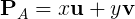

```latex
\begin {aligned} 
\bold P_{A} = x \bold u + y \bold v
\end{aligned}
```

이번에는 `P_{B}` 를 B 좌표계의 기저벡터 `{u}', {v}'` 를 이용하여 다음과 같이 표현할 수 있다.

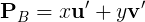

```latex
\begin {aligned} 
\bold P_{B} = x \bold {u}' + y \bold {v}'
\end{aligned}
```

`{u}', {v}'` 는 각각 `u, v` 를 선형변환하여 얻어 낸 것이다. 따라서 선형변환에 해당하는 행렬 A 를 `u, v` 에 곰셉연산하여 `{u}', {v}'` 를 구할 수 있다.

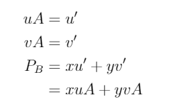

```latex
\begin {aligned} 
\bold u A   &= \bold {u}' \\
\bold v A   &= \bold {v}' \\
\bold P_{B} &= x \bold {u}' + y \bold {v}' \\
            &= x u A + y v A
\end{aligned}
```

예를 들어서 A 좌표계의 좌표 `1, 2` 를 B 좌표계의 좌표로 변환해 보자. A 좌표계를 시계방향으로 90 도 회전하여 B 좌표계를 얻어냈다고 하자.


```latex
\begin {aligned} 
\bold u A   &= \bold {u}' \\
\bold v A   &= \bold {v}' \\
\bold P_{B} &= x \bold {u}' + y \bold {v}' \\
            &= 1 \cdot (1,0) A + 2 \cdot (0, 1) A \\
            &= (-2, 1)
\end{aligned}
```

정리하면 A 좌표계의 `x, y` 와 기저벡터 `u, v` 그리고 A 좌표계를 B 좌표계로 변환하기 위한 행렬 `A` 를 알면 `{x}',{y}'` 를 구할 수 있다.

지금까지 2D 를 기준으로 설명한 것을 3D 를 기준으로 다음과 같이 확장할 수 있다.

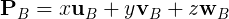

```latex
\begin {aligned} 
\bold P_{B} = x \bold u_{B} + y \bold v_{B} + z \bold w_{B}
\end{aligned}
```

점의 경우는 다음과 같이 이동변환을 추가하여 이해할 수 있다.

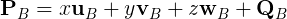

```latex
\begin {aligned} 
\bold P_{B} = x \bold u_{B} + y \bold v_{B} + z \bold w_{B} + \bold Q_{B}
\end{aligned}
```


```latex
\documentclass[tikz,border=10pt]{standalone}

\usepackage{tikz}
\usepackage{rotating}

\usetikzlibrary{scopes}
\usetikzlibrary{calc}

\begin{document}

\begin{tikzpicture}
    \def\rotangle{30}
    \def\angvalue{30}
    \def\rad{3}
    \def\x{2} \def\y{1.5}
	\tikzset{arrow_style/.style={>=latex,very thick}}
	
        \coordinate (PA) at (\angvalue:2.5 cm);
        \begin{turn}{\rotangle}
    		\fill[draw=black] (PA) circle (1.5pt);
    		\fill[draw=black] (0,0) circle (1.5pt);
            
        {[arrow_style]
            \draw[->]let \p{PA}=(PA) in (\x{PA},0) node [black,below,rotate=360-\rotangle] {\large$x$}--(PA) node [black,right,midway,rotate=360-\rotangle] {\large$yv$};
            \draw[->]let \p{PA}=(PA) in (0,\y{PA}) node [black,left,rotate=360-\rotangle] {\large$y$}--(PA) node [black,above,midway,rotate=360-\rotangle] {\large$xu$};
            \draw [black!50,<->] (0,-1.5)--(0,3) node [black,above] {$+Y$};
            \draw [black!50,<->] (-3,0)--(3,0) node [black,right] {$+X$};
            \draw[->] (0,0)--(0,1) node [black,midway,left,rotate=360-\rotangle] {\large $v$};
            \draw[->] (0,0)--(1,0) node [black,midway,below,rotate=360-\rotangle] {\large $u$};
            
        }
        
        \end{turn}
        \coordinate [label=left:\large$FrameA$] (t) at (-1,0);
        
        % frame B center : 5,-2
        {[arrow_style]
            \draw [->] (5,-2)--(0,0) node [black,above,midway] {$\mathbf{Q}$};
            \draw [black!50,<->] (5,-3)--(5,3) node [black,above] {$+Y$};
            \draw [black!50,<->] (-0.5,-2)--(7,-2) node [black,right] {$+X$};
        }
        \coordinate[label=above:\large${p_{A}=(x,y)}$] (PA) at (\rotangle+\angvalue:2.5 cm);
        \draw[densely dashed]let \p{PA}=(PA) in (PA) -- (\x{PA},-2) node [black,below] {\large$x'$};
        \draw[densely dashed]let \p{PA}=(PA) in (PA) -- (5,\y{PA})node [black,right] {\large$y'$};
	
        \coordinate [label=right:\large$FrameB$] (t) at (5.5,-2.5);
    
\end{tikzpicture}

\end{document}
```

좌표계의 변환도 동차좌표를 사용하여 벡터와 점을 처리하는 하나의 공식으로 만들 수 있으며, 행렬로 표현할 수 있다.


```latex
\begin {aligned} 
\\(x',y',z',w) &= xu_{B} + yv_{B} + zw_{B} + wQ_{B} \\
\left[x',y',z',w\right] &= [x,y,z,w]\begin{bmatrix}
                           u_{x} & u_{y} & u_{z} & 0\\ 
                           v_{x} & v_{y} & v_{z} & 0\\ 
                           w_{x} & w_{y} & w_{z} & 0\\ 
                           Q_{x} & Q_{y} & Q_{z} & 1
                           \end{bmatrix} \\
                        &= xu_{B} + yv_{B} + zw_{B} + wQ_{B}
\end{aligned}
```

위의 식에서 표현된 4x4 행렬을 좌표 변경 행렬(change of coordinate matrix) 또는 좌표계 변경 행렬(change of frame matrix)라고 부르고, 행렬이 수행하는 변환을 지칭할 때 "변환한다(convert)" 또는 "사상한다(map)"라고 말한다.


# 좌표변환과 좌표계의 변환

특정좌표 `x, y, z` 를 아핀변환한 것은 다음과 같다.


```latex
\begin{aligned}
\alpha(x, y, z) &= \tau(x, y, z) + \bold b \\
                &= x \tau(\bold i) + y \tau(\bold j) + z \tau(\bold k) + \bold b \\
                &= \begin{bmatrix}
                     x & y & z & w
                   \end{bmatrix} 
                   \begin{bmatrix}
                     \leftarrow \tau(\bold i) \rightarrow \\
                     \leftarrow \tau(\bold i) \rightarrow \\
                     \leftarrow \tau(\bold i) \rightarrow \\
                     \leftarrow \bold b \rightarrow \\
                   \end{bmatrix} \\
                &= \begin{bmatrix}
                     {x}' & {y}' & {z}' & {w}'
                   \end{bmatrix} 
\end{aligned}
```

특정좌표 `x, y, z` 의 좌표계를 변환한 것은 다음과 같다.

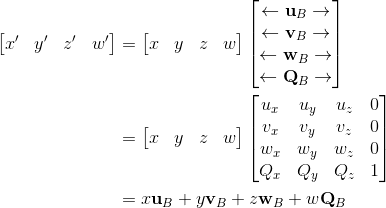

```latex
\begin{aligned}
\begin{bmatrix}
  {x}' & {y}' & {z}' & {w}'
\end{bmatrix} 
                &= \begin{bmatrix}
                     x & y & z & w
                   \end{bmatrix} 
                   \begin{bmatrix}
                     \leftarrow \bold u_{B} \rightarrow \\
                     \leftarrow \bold v_{B} \rightarrow \\
                     \leftarrow \bold w_{B} \rightarrow \\
                     \leftarrow \bold Q_{B} \rightarrow \\
                   \end{bmatrix} \\
                &= \begin{bmatrix}
                     x & y & z & w
                   \end{bmatrix} 
                   \begin{bmatrix}
                     u_{x} & u_{y} & u_{z} & 0 \\
                     v_{x} & v_{y} & v_{z} & 0 \\
                     w_{x} & w_{y} & w_{z} & 0 \\
                     Q_{x} & Q_{y} & Q_{z} & 1 \\
                   \end{bmatrix} \\
                &= x \bold u_{B} + y \bold v_{B} + z \bold w_{B} + w \bold Q_{B}
\end{aligned}
```

아핀변환을 한 것은 좌표계를 변환한 것과 같다.(equivalence)

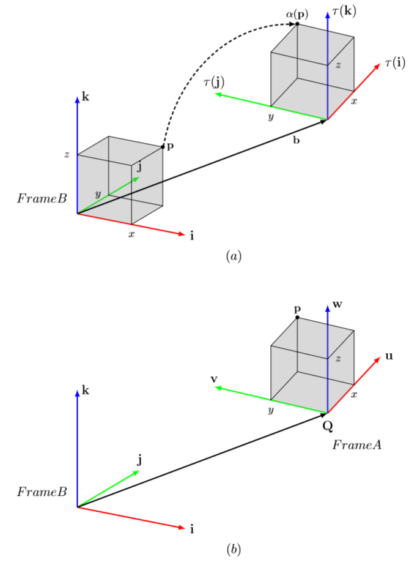

```latex
\documentclass[tikz,border=10pt]{standalone}

\usepackage{tikz}
\usepackage{tikz-3dplot}

\usetikzlibrary{scopes}

\begin{document}

\begin{tikzpicture}
	\tikzset{arrow_style/.style={>=latex,very thick}}
    \def\AxisSize{4}
    \def\CubeSize{2}
        
	\matrix[row sep=1cm] {
        \tdplotsetmaincoords{70}{30}
        \begin{scope}[tdplot_main_coords]
            % The vertex at V
            \coordinate (P) at (\CubeSize,\CubeSize,\CubeSize);
            
            % axis draw
            {[arrow_style]
                \draw [red,->] (0,0,0)--(\AxisSize,0,0) node [black,above,right] {\large $\mathbf{i}$};
                \draw [green,->] (0,0,0)--(0,\AxisSize,0) node [black,above] {\large $\mathbf{j}$};
                \draw [blue,->] (0,0,0)--(0,0,\AxisSize) node [black,right] {\large $\mathbf{k}$};
            }
            
            % cube draw
            \fill[black!50, opacity=0.3]
              (0,\CubeSize,\CubeSize) -- (\CubeSize,\CubeSize,\CubeSize) -- (\CubeSize,0,\CubeSize) -- (0,0,\CubeSize) -- cycle; 
            \fill[black!50, opacity=0.3]
              (0,0,\CubeSize) -- (\CubeSize,0,\CubeSize) -- (\CubeSize,0,0) -- (0,0,0) -- cycle;
            \fill[black!50, opacity=0.3]
              (\CubeSize,0,0) -- (\CubeSize,\CubeSize,0) -- (\CubeSize,\CubeSize,\CubeSize) -- (\CubeSize,0,\CubeSize) -- cycle;
            \draw (P) -- (\CubeSize,0,\CubeSize) --(0,0,\CubeSize) --(0,\CubeSize,\CubeSize) --(P) --(\CubeSize,\CubeSize,0) --(\CubeSize,0,0) --(\CubeSize,0,\CubeSize);
            \draw (\CubeSize,\CubeSize,0) -- (0,\CubeSize,0) --(0,\CubeSize,\CubeSize);
            
            % dot label draw
    		\fill[draw=black] (P) circle (1.5pt) node [above,right]{$\mathbf{p}$};
    		\node[label=below:$x$] at (\CubeSize,0,0);
    		\node[label=left:$y$] at (0,\CubeSize,0);
    		\node[label=left:$z$] at (0,0,\CubeSize);
        \end{scope}
        
        \tdplotsetmaincoords{60}{-65}
        \begin{scope}[tdplot_main_coords,xshift=8cm,yshift=3cm]
            % The vertex at V
            \coordinate (P) at (\CubeSize,\CubeSize,\CubeSize);
            
            % axis draw
            {[arrow_style]
                \draw [red,->] (0,0,0)--(\AxisSize,0,0) node [black,above,right] {\large $\tau(\mathbf{i})$};
                \draw [green,->] (0,0,0)--(0,\AxisSize,0) node [black,above] {\large $\tau(\mathbf{j})$};
                \draw [blue,->] (0,0,0)--(0,0,\AxisSize) node [black,right] {\large $\tau(\mathbf{k})$};
            }
            
            % cube draw
            \fill[black!50, opacity=0.3]
              (0,\CubeSize,\CubeSize) -- (\CubeSize,\CubeSize,\CubeSize) -- (\CubeSize,0,\CubeSize) -- (0,0,\CubeSize) -- cycle; 
            \fill[black!50, opacity=0.3]
              (0,0,\CubeSize) -- (\CubeSize,0,\CubeSize) -- (\CubeSize,0,0) -- (0,0,0) -- cycle;
            \fill[black!50, opacity=0.3]
              (0,\CubeSize,0) -- (0,\CubeSize,\CubeSize) -- (0,0,\CubeSize) -- (0,0,0) -- cycle;
            \draw (P) -- (\CubeSize,0,\CubeSize) --(0,0,\CubeSize) --(0,\CubeSize,\CubeSize) --(P) --(\CubeSize,\CubeSize,0) --(\CubeSize,0,0) --(\CubeSize,0,\CubeSize);
            \draw (\CubeSize,\CubeSize,0) -- (0,\CubeSize,0) --(0,\CubeSize,\CubeSize);
            
            % dot label draw
    		\fill[draw=black] (P) circle (1.5pt) node [above]{$\alpha(\mathbf{p})$};
    		\node[label=below:$x$] at (\CubeSize,0,0);
    		\node[label=below:$y$] at (0,\CubeSize,0);
    		\node[label=right:$z$] at (0,0,\CubeSize);
        \end{scope}
        
        \draw[->,>=latex,very thick] (0,0) -- (8cm,3cm) node [black,below,very near end] {$\mathbf{b}$};
        \draw[->,>=latex,very thick,densely dashed] (2.75,2.15) to[out=80,in=180] (7,6.05);
        \coordinate [label=left:\large$FrameB$] (t) at (-0.2,0.5);
        \coordinate [label=\large$(a)$] (t) at (5,-1.7);
    
	\\
        \tdplotsetmaincoords{70}{30}
        \begin{scope}[tdplot_main_coords]
            % The vertex at V
            \coordinate (P) at (\CubeSize,\CubeSize,\CubeSize);
            
            % axis draw
            {[arrow_style]
                \draw [red,->] (0,0,0)--(\AxisSize,0,0) node [black,above,right] {\large $\mathbf{i}$};
                \draw [green,->] (0,0,0)--(0,\AxisSize,0) node [black,above] {\large $\mathbf{j}$};
                \draw [blue,->] (0,0,0)--(0,0,\AxisSize) node [black,right] {\large $\mathbf{k}$};
            }
        \end{scope}
        
        \tdplotsetmaincoords{60}{-65}
        \begin{scope}[tdplot_main_coords,xshift=8cm,yshift=3cm]
            % The vertex at V
            \coordinate (P) at (\CubeSize,\CubeSize,\CubeSize);
            
            % axis draw
            {[arrow_style]
                \draw [red,->] (0,0,0)--(\AxisSize,0,0) node [black,above,right] {\large $\mathbf{u}$};
                \draw [green,->] (0,0,0)--(0,\AxisSize,0) node [black,above] {\large $\mathbf{v}$};
                \draw [blue,->] (0,0,0)--(0,0,\AxisSize) node [black,right] {\large $\mathbf{w}$};
            }
            
            % cube draw
            \fill[black!50, opacity=0.3]
              (0,\CubeSize,\CubeSize) -- (\CubeSize,\CubeSize,\CubeSize) -- (\CubeSize,0,\CubeSize) -- (0,0,\CubeSize) -- cycle; 
            \fill[black!50, opacity=0.3]
              (0,0,\CubeSize) -- (\CubeSize,0,\CubeSize) -- (\CubeSize,0,0) -- (0,0,0) -- cycle;
            \fill[black!50, opacity=0.3]
              (0,\CubeSize,0) -- (0,\CubeSize,\CubeSize) -- (0,0,\CubeSize) -- (0,0,0) -- cycle;
            \draw (P) -- (\CubeSize,0,\CubeSize) --(0,0,\CubeSize) --(0,\CubeSize,\CubeSize) --(P) --(\CubeSize,\CubeSize,0) --(\CubeSize,0,0) --(\CubeSize,0,\CubeSize);
            \draw (\CubeSize,\CubeSize,0) -- (0,\CubeSize,0) --(0,\CubeSize,\CubeSize);
            
            % dot label draw
    		\fill[draw=black] (P) circle (1.5pt) node [above]{$\mathbf{p}$};
    		\node[label=below:$x$] at (\CubeSize,0,0);
    		\node[label=below:$y$] at (0,\CubeSize,0);
    		\node[label=right:$z$] at (0,0,\CubeSize);
        \end{scope}
        
        \draw[->,>=latex,very thick] (0,0) -- (8cm,3cm);
    	\node[label=below:\large$\mathbf{Q}$] at (8cm,3cm);
        \coordinate [label=right:\large$FrameA$] (t) at (8,2);
        \coordinate [label=left:\large$FrameB$] (t) at (-0.2,0.5);
        \coordinate [label=\large$(b)$] (t) at (5,-1.7);
    \\
	};
\end{tikzpicture}

\end{document}
```

(a)에서는 하나의 좌표계 B를 기준으로 아핀변환을 적용해서 입방체의 위치와 방향을 변경한다. (b)에서는 A와 B라는 두 개의 좌표계를 사용하여 A에 상대적인 입방체 점들의 좌표를 B에 상대적인 좌표들로 변환한다. 두 경우 모두 좌표계 B를 기준으로 `\alpha(p) = (x',y',z',w) = p_{B}`가 성립한다. b = Q이고 `\tau(i) = u, \tau(j) = v, \tau(k) = w`이다.


# 비례 선형변환 증명

비례변환은 다음 그림의 식을 통해 선형변환의 성질을 만족한다는 것을 확인할 수 있다.

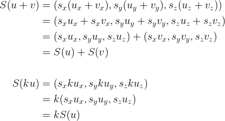

```latex
\begin {aligned} 
S(u + v) &= (s_{x}(u_{x} + v_{x}), s_{y}(u_{y} + v_{y}), s_{z}(u_{z} + v_{z})) \\
         &= (s_{x}u_{x} + s_{x}v_{x}, s_{y}u_{y} + s_{y}v_{y}, s_{z}u_{z} + s_{z}v_{z}) \\
         &= (s_{x}u_{x}, s_{y}u_{y}, s_{z}u_{z}) + (s_{x}v_{x}, s_{y}v_{y}, s_{z}v_{z}) \\
         &= S(u) + S(v) \\
\\
S(ku) &= (s_{x}ku_{x}, s_{y}ku_{y}, s_{z}ku_{z}) \\
      &= k(s_{x}u_{x}, s_{y}u_{y}, s_{z}u_{z}) \\
      &= kS(u) \\
\end{aligned}
```

비례변환에 표준기저벡터를 곱하면 각 축에 해당하는 원소의 크기를 변경하는 비례행렬을 얻을 수 있다.

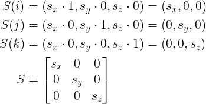

```latex
\begin{aligned}
S(i) &= (s_{x}\cdot 1, s_{y}\cdot 0, s_{z}\cdot 0) = (s_{x}, 0, 0) \\
S(j) &= (s_{x}\cdot 0, s_{y}\cdot 1, s_{z}\cdot 0) = (0, s_{y}, 0) \\
S(k) &= (s_{x}\cdot 0, s_{y}\cdot 0, s_{z}\cdot 1) = (0, 0, s_{z}) \\
S    &=  \begin{bmatrix}
         s_{x} & 0 & 0\\ 
         0& s_{y} & 0\\ 
         0&  0& s_{z}
         \end{bmatrix}
\end{aligned}
```

비례변환의 행렬 S는 비례행렬(scaling matrix)이라고 부른다. 

`s_{x}`는 x축의 비율을, `s_{y}`는 y축의 비율을, `s_{z}`는 z축의 비율을 조절한다.


# 회전 선형변환 증명

벡터 v를 축 n에 대해 회전하는 변환을 표현하기 위해서는 복잡한 식의 계산이 필요하다.

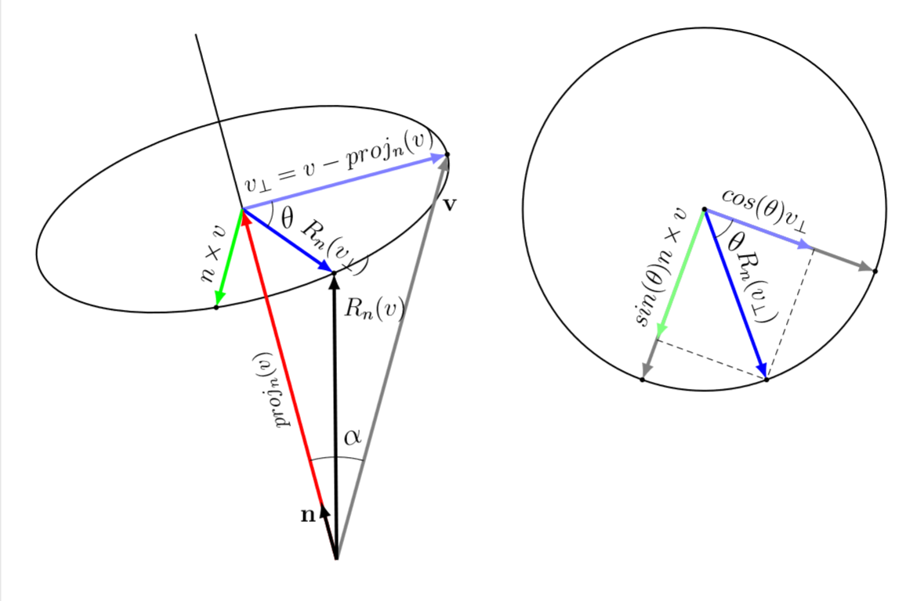

```latex
\documentclass[tikz,border=10pt]{standalone}

\usepackage{tikz}
\usepackage{rotating}

\usetikzlibrary{scopes}
\usetikzlibrary{quotes,angles}
\usetikzlibrary{intersections}

\begin{document}

\begin{tikzpicture}
    \def\picrot{15}
	\def\a{3.5} \def\b{1.5}
	\def\xp{0} \def\yp{-6}
	\def\angvalue{50}
	\def\ptsize{1.0pt}
	\tikzset{p_style/.style={draw=black}}
	\tikzset{arrow_style/.style={>=latex,ultra thick}}
	
	\matrix[column sep=1cm] {
    	
        \begin{turn}{\picrot}
        	\draw[name path=ellipse,black,thick]
        		(0,0) circle[x radius = \a cm, y radius = \b cm];
            %\draw (0,0) ellipse (\a cm and \b cm);
        	\coordinate (P) at (\xp,\yp);
        	
        	\path[name path=lineOV] (0,0)--(\a,0);
        	\path [name intersections={of = ellipse and lineOV}];
        	\coordinate (V) at (intersection-1);
        	\path[name path=lineOA] (0,0)--(240:\a cm);
        	\path [name intersections={of = ellipse and lineOA}];
        	\coordinate (A) at (intersection-1);
        	\path[name path=lineOB] (0,0)--(360-\angvalue:\a cm);
        	\path [name intersections={of = ellipse and lineOB}];
        	\coordinate (B) at (intersection-1);
        	
        	\draw[black,thick] (0,0) -- (0,3);
        	{[arrow_style,->]
        	    \draw[black!50](P) -- (V) node[black,very near end,right,rotate=360-\picrot] {\large$\textbf{v}$};
        	    \draw[blue!50](0,0) -- (V) node[black,midway,sloped,above] {\large $v_{\perp}=v-proj_{n}(v)$};
        	    \draw[blue](0,0) -- (B) node[black,very near end,sloped,above] {\large $R_{n}(v_{\perp})$};
        	    \draw[green](0,0) -- (A) node[black,midway,sloped,above] {\large $n\times v$};
        	    \draw[red](P) -- (0,0) node[black,midway,sloped,above] { $proj_{n}(v)$};
        	    \draw[black](P) -- (B) node[black,very near end,right,rotate=360-\picrot] {\large $R_{n}(v)$};
        	    \draw[black](P) -- (0,\yp+1) node[black,near end,left,rotate=360-\picrot] {\large $\textbf{n}$};
        	}
        	\coordinate (O) at (0,0);
        	\draw pic[draw=black,angle eccentricity=1.2,angle radius=1.7cm] {angle=V--P--O};
        	\draw pic["\Large $\alpha$",angle eccentricity=1.2,angle radius=1.7cm] {angle=V--P--B};
        	\draw pic["\Large $\theta$",draw=black,angle eccentricity=1.5,angle radius=0.5cm] {angle=B--O--V};
        	
        	\foreach \p in {A,B,V}
        		\fill[p_style] (\p) circle (\ptsize);
        \end{turn}
            
        &
            
        \def\angvalue{50}
        \def\rad{3}
        
        \begin{turn}{340}
        	\draw[name path=proj,black,thick]
        		(0,0) circle(\rad);
        	\coordinate (O) at (0,0);
        	\coordinate (A) at (\rad,0);
        	\coordinate (B) at (0,-\rad);
        	\path [name path=lineOV] (0,0)--(360-\angvalue:\rad cm);
        	\path [name intersections={of = proj and lineOV}];
        	\coordinate (V) at (intersection-1);
        	
        	\coordinate (CA) at ({\rad*cos(\angvalue)},0);
        	\coordinate (SB) at (0,{-\rad*sin(\angvalue)});
        	
        	{[arrow_style,->]
        	    \draw[black!50](O) -- (A);
        	    \draw[black!50](O) -- (B);
        	    \draw[blue](O) -- (V) node[black,midway,sloped,above] {\large$R_{n}(v_{\perp})$};
        	    \draw[blue!50](O) -- (CA) node[black,midway,sloped,above] {\large$cos(\theta)v_{\perp}$};
        	    \draw[green!50](O) -- (SB) node[black,midway,sloped,above,rotate=180] {\large$sin(\theta)n\times v$};
        	}
        	\draw pic["\Large $\theta$",draw=black,angle eccentricity=1.5,angle radius=0.5cm] {angle=V--O--A};
            \draw[densely dashed](CA)--(V);
            \draw[densely dashed](SB)--(V);
        	
        	\foreach \p in {O,A,B,V}
        		\fill[draw=black] (\p) circle (1.0pt);
        \end{turn}
    \\   
	};
\end{tikzpicture}

\end{document}
```

(위의 그림에서 회전각은 n의 진행방향을 기준으로 반시계방향으로 측정하며, n의 크기는 1이라고 가정한다.)

먼저, 벡터 v를 축 n에 평행한 정사영벡터 `proj_{n}(v)`와 n에 수직인 벡터 `v_{\perp}`로 쪼갠다. 정사영벡터는 n과 평행하기 때문에 수직인 벡터의 회전방법만 알아내면 회전 후의 v를 알아낼 수 있다.

`R_{n}(v_{\perp})`를 알아내기 위해서 n과 `v_{\perp}`에 수직인 벡터 `n \times v`(외적)를 구한다. `n \times v`의 크기는 다음과 같은 공식으로 `v_{\perp}`와 크기가 같다는 것을 알 수 있다.


```latex
\begin {aligned} 
\left\| n \times v \right\| &= \left\| n \right\| \left\| v \right\| sin\alpha \\
                            &= \left\| v \right\| sin\alpha \\
                            &= \left\| v_{\perp} \right\|
\end{aligned}
```

`v_{\perp}`와 `n \times v` 두 개의 벡터를 통해 `R_{n}(v_{\perp})`를 구할 수 있다.


```latex
R_{n}(v_{\perp}) = cos\theta v_{\perp} + sin\theta(n \times v)
```

이를 통해 다음과 같은 공식을 이끌어낼 수 있다.


```latex
\begin {aligned} 
R_{n}(v) &= proj_{n}(v) + R_{n}(v_{\perp}) \\
         &= (n\cdot v)n + cos\theta v_{\perp} + sin\theta(n\times v) \\
         &= (n\cdot v)n + cos\theta(v-(n\cdot v)n) + sin\theta(n\times v) \\
         &= cos\theta v +(1-cos\theta)(n\cdot v)n + sin\theta(n\times v)
\end{aligned}
```

해당 공식 내부의 벡터를 (x,y,z) 형태로 변환하면 다음과 같이 표현할 수 있다.


```latex
\begin {aligned} 
R_{n}(v_{x},v_{y},v_{z}) &= c(v_{x},v_{y},v_{z}) \\
                         &\ + (1-c)(n_{x}v_{x}+n_{y}v_{y}+n_{z}v_{z})(n_{x},n_{y},n_{z}) \\
                         &\ + s(n_{y}v_{z}-n_{z}v_{y},n_{z}v_{x}-n_{x}v_{z},n_{x}v_{y}-n_{y}v_{z})
\\ &
\\ & (c = cos\theta,s = sin\theta)
\end{aligned}
```

위의 식에 표준기저벡터를 적용하여 나온 벡터들을 행으로 삼아서 하나의 행렬을 만들면 벡터 v를 축 n에 대해 회전시키는 회전행렬이 나온다.


```latex
\begin{aligned} 
\\R_{n} &= \begin{bmatrix}
          c+(1-c)(n_{x})^2 & (1-c)n_{x}n_{y}+sn_{z} & (1-c)n_{x}n_{z}-sn_{y}\\ 
          (1-c)n_{x}n_{y}-sn_{z} & c+(1-c)(n_{y})^2 & (1-c)n_{y}n_{z}+sn_{x}\\ 
          (1-c)n_{x}n_{z}+sn_{y} & (1-c)n_{y}n_{z}-sn_{x} & c+(1-c)(n_{z})^2
          \end{bmatrix}
\\ & (c = cos\theta,s = sin\theta)
\end{aligned}
```

회전행렬의 각 행벡터는 단위길이이고, 서로 직교이기 때문에 정규직교이다. 직교행렬은 역행렬이 자신의 전치행렬과 같다는 속성이 있다.


```latex
\\R_{n}^{-1}=R_{n}^{T}=\begin{bmatrix}
c+(1-c)(n_{x})^2 & (1-c)n_{x}n_{y}-sn_{z} & (1-c)n_{x}n_{z}+sn_{y}\\ 
(1-c)n_{x}n_{y}+sn_{z} & c+(1-c)(n_{y})^2 & (1-c)n_{y}n_{z}-sn_{x}\\ 
(1-c)n_{x}n_{z}-sn_{y} & (1-c)n_{y}n_{z}+sn_{x} & c+(1-c)(n_{z})^2
\end{bmatrix}
\\(c=cos\theta,s=sin\theta)
```

회전축이 x축, y축, z축인 경우(n = (1,0,0), (0,1,0), (0,0,1))는 회전행렬이 매우 간단해진다.


```latex
\begin{aligned}
R_{x} &= \begin{bmatrix}
         1 & 0 & 0\\ 
         0 & cos\theta & sin\theta\\ 
         0 & -sin\theta & cos\theta
         \end{bmatrix} \\
R_{y}    &= \begin{bmatrix}
            cos\theta & 0 & -sin\theta\\ 
            0 & 1 & 0\\ 
            sin\theta & 0 & cos\theta
            \end{bmatrix} \\
R_{z}    &= \begin{bmatrix}
            cos\theta & sin\theta & 0\\ 
            -sin\theta & cos\theta & 0\\ 
            0 & 0 & 1
            \end{bmatrix}
\end{aligned}
```