# Abstract 

변환에 대해 정리한다.

# 1. 선형변환 

## 정의

어떠한 수학 함수 `\tau(v) = \tau(x, y, z) = (x', y', z')`가 존재할 때,
선형변환(Linear Transformation)은 다음과 같은 성질이 성립하는 함수 `\tau`를 가리킨다.

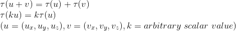

```
\\\tau(u+v)=\tau(u)+\tau(t)
\\\tau(ku)=k\tau(u)
\\(u=(u_{x},u_{y},u_{z}),v=(v_{x},v_{y},v_{z}),k=arbitrary\ scalar\ value)
```

## 행렬 표현

u = (x, y, z)라 할 때, 다음의 식으로 표현할 수 있다.

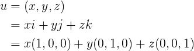

```
u=(x,y,z)=xi+yj+zk=x(1,0,0)+y(0,1,0)+z(0,0,1)
```

벡터 i, j, k 는 삼차원 좌표계의 축과 같은 방향의 단위벡터로, 표준기저벡터(standard basis vector)라고 부른다. `\tau`를 선형변환이라 할 때, 다음의 식이 성립하며, 벡터와 행렬의 곱으로 표현할 수 있다.


```
\\\tau(u)=\tau(xi+yj+zk)=x\tau(i)+y\tau(j)+z\tau(k)
\\=uA=[x,y,z]\begin{bmatrix} \leftarrow \tau(i) \rightarrow 
\\ \leftarrow \tau(j) \rightarrow 
\\ \leftarrow \tau(k) \rightarrow 
\end{bmatrix}=[x,y,z]\begin{bmatrix} A_{11} & A_{12} & A_{13}
\\  A_{21} & A_{22} & A_{23} 
\\  A_{31} & A_{32} & A_{33}
\end{bmatrix}\\
\\\tau(i)=(A_{11}, A_{12}, A_{13}),\tau(j)=(A_{21}, A_{22}, A_{23}),\tau(k)=(A_{31}, A_{32}, A_{33})
```

위의 식에서 표현되는 행렬 A를 선형변환 `\tau`의 행렬 표현(matrix representation)이라고 부른다.

## 비례

물체의 크기를 특정 좌표축에 대하여 특정 비율만큼 조절하고 싶을 때 비례변환(scaling)을 사용하며, 다음과 같이 정의된다. 행렬 표현으로도 표현할 수 있다.

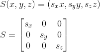

```
\\S(x,y,z)=(s_{x}x,s_{y}y,s_{z}z)
\\\\S=\begin{bmatrix}
s_{x} & 0 & 0\\ 
 0& s_{y} & 0\\ 
 0&  0& s_{z}
\end{bmatrix}
```

비례변환의 행렬 S는 비례행렬(scaling matrix)이라고 부른다. 

`s_{x}`는 x축의 비율을, `s_{y}`는 y축의 비율을, `s_{z}`는 z축의 비율을 조절한다.

## 회전

벡터 v를 축 n에 대해 회전하는 변환을 표현하기 위해서는 복잡한 식의 계산이 필요하다.


(위의 그림에서 회전각은 n의 진행방향을 기준으로 반시계방향으로 측정하며, n의 크기는 1이라고 가정한다.)

먼저, 벡터 v를 축 n에 평행한 정사영벡터 `proj_{n}(v)`와 n에 수직인 벡터 `v_{\perp}`로 쪼갠다. 정사영벡터는 n과 평행하기 때문에 수직인 벡터의 회전방법만 알아내면 회전 후의 v를 알아낼 수 있다.

`R_{n}(v_{\perp})`를 알아내기 위해서 n과 `v_{\perp}`에 수직인 벡터 `n \times v`(외적)를 구한다. `n \times v`의 크기는 다음과 같은 공식으로 `v_{\perp}`와 크기가 같다는 것을 알 수 있다.

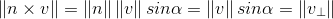

```
\left\| n \times v \right\|=\left\| n \right\|\left\| v \right\|sin\alpha=\left\| v \right\|sin\alpha=\left\| v_{\perp} \right\|
```

`v_{\perp}`와 `n \times v` 두 개의 벡터를 통해 `R_{n}(v_{\perp})`를 구할 수 있다.

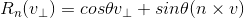

```
R_{n}(v_{\perp})=cos\theta v_{\perp}+sin\theta(n \times v)
```

이를 통해 다음과 같은 공식을 이끌어낼 수 있다.

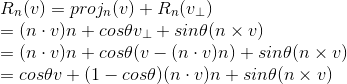

```
\\R_{n}(v)=proj_{n}(v)+R_{n}(v_{\perp})
\\=(n\cdot v)n+cos\theta v_{\perp}+sin\theta(n\times v)
\\=(n\cdot v)n+cos\theta(v-(n\cdot v)n)+sin\theta(n\times v)
\\=cos\theta v+(1-cos\theta)(n\cdot v)n+sin\theta(n\times v)
```

해당 공식 내부의 벡터를 (x,y,z) 형태로 변환하면 다음과 같이 표현할 수 있다.

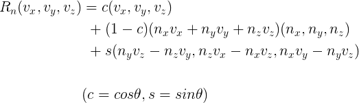

```
\\R_{n}(v_{x},v_{y},v_{z})=c(v_{x},v_{y},v_{z})+(1-c)(n_{x}v_{x}+n_{y}v_{y}+n_{z}v_{z})(n_{x},n_{y},n_{z})+s(n_{y}v_{z}-n_{z}v_{y},n_{z}v_{x}-n_{x}v_{z},n_{x}v_{y}-n_{y}v_{z})
\\(c=cos\theta,s=sin\theta)
```

위의 식에 표준기저벡터를 적용하여 나온 벡터들을 행으로 삼아서 하나의 행렬을 만들면 벡터 v를 축 n에 대해 회전시키는 회전행렬이 나온다.

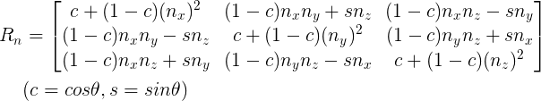

```
\\R_{n}=\begin{bmatrix}
c+(1-c)(n_{x})^2 & (1-c)n_{x}n_{y}+sn_{z} & (1-c)n_{x}n_{z}-sn_{y}\\ 
(1-c)n_{x}n_{y}-sn_{z} & c+(1-c)(n_{y})^2 & (1-c)n_{y}n_{z}+sn_{x}\\ 
(1-c)n_{x}n_{z}+sn_{y} & (1-c)n_{y}n_{z}-sn_{x} & c+(1-c)(n_{z})^2
\end{bmatrix}
\\(c=cos\theta,s=sin\theta)
```

회전행렬의 각 행벡터는 단위길이이고, 서로 직교이기 때문에 정규직교이다. 직교행렬은 역행렬이 자신의 전치행렬과 같다는 속성이 있다.

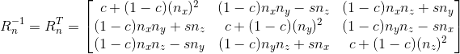

```
\\R_{n}^{-1}=R_{n}^{T}=\begin{bmatrix}
c+(1-c)(n_{x})^2 & (1-c)n_{x}n_{y}-sn_{z} & (1-c)n_{x}n_{z}+sn_{y}\\ 
(1-c)n_{x}n_{y}+sn_{z} & c+(1-c)(n_{y})^2 & (1-c)n_{y}n_{z}-sn_{x}\\ 
(1-c)n_{x}n_{z}-sn_{y} & (1-c)n_{y}n_{z}+sn_{x} & c+(1-c)(n_{z})^2
\end{bmatrix}
\\(c=cos\theta,s=sin\theta)
```

회전축이 x축, y축, z축인 경우(n = (1,0,0), (0,1,0), (0,0,1))는 회전행렬이 매우 간단해진다.

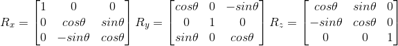

```
\\R_{x}=\begin{bmatrix}
1 & 0 & 0\\ 
0 & cos\theta & sin\theta\\ 
0 & -sin\theta & cos\theta
\end{bmatrix} 
R_{y}=\begin{bmatrix}
cos\theta & 0 & -sin\theta\\ 
0 & 1 & 0\\ 
sin\theta & 0 & cos\theta
\end{bmatrix}
R_{z}=\begin{bmatrix}
cos\theta & sin\theta & 0\\ 
-sin\theta & cos\theta & 0\\ 
0 & 0 & 1
\end{bmatrix}
```

# 2. 아핀변환

* 아핀 공간 (affine space)
아핀 공간은 원점을 알 수 없는 일종의 벡터 공간이다. 벡터 공간에서는 위치가 다르더라도 크기와 방향만 같으면 모두 같은 벡터로 취급하기 때문에 위치 중심의 기하학을 표현할 수가 없다. 이 점을 극복하기 위하여 고안된 구조가 아핀 공간이다. 아핀 공간은 벡터에 점을 추가하여 벡터의 위치를 표현할 수 있다.

아핀변환(affine transformation; 어파인 변환, 상관변환)은 선형변환에 이동변환(translation transformation)을 결합한 것이다. 그러나 벡터는 위치정보, 점에 대한 정보를 가지지 않기 때문에 이동을 표현할 수 없다. 그래서 점과 벡터를 동일한 계산식으로 다루기 위해 동차좌표(homogeneous coordinate)라는 것을 사용한다.

동차좌표는 3차원 벡터에 w성분을 추가한 네쌍값(4-tuple)의 형태를 가지며 벡터인지 점인지는 w의 값으로 결정한다. 0이면 벡터, 1이면 점으로 표기한다. 벡터+벡터=벡터, 벡터+점=점, 점-점=벡터 의 계산을 만족한다.

다음은 아핀변환을 행렬로 표기한 식과, 동차좌표를 도입하여 행렬로 표기한 식이다.

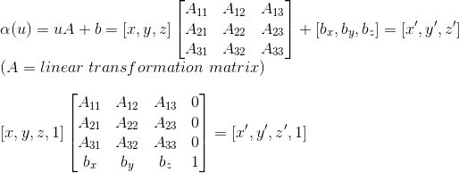

```
\\\alpha(u)=uA+b=[x,y,z]\begin{bmatrix} A_{11} & A_{12} & A_{13}
\\ A_{21} & A_{22} & A_{23} 
\\ A_{31} & A_{32} & A_{33}
\end{bmatrix}+[b_{x},b_{y},b_{z}]=[x',y',z']
\\(A=linear\ transformation\ matrix)\\
\\\left[ x,y,z,1 \right]\begin{bmatrix}
A_{11} & A_{12} & A_{13} & 0\\ 
A_{21} & A_{22} & A_{23} & 0\\ 
A_{31} & A_{32} & A_{33} & 0\\ 
b_{x} & b_{y} & b_{z} & 1
\end{bmatrix}=[x',y',z',1]
```

이동변환은 b의 값만이 계산되는 형태이기 때문에, 선형변환 부분이 하나의 단위행렬인 아핀변환이라고 할 수 있다. 행렬로 표현할 수 있으며 이동행렬(translation matrix)이라고 부른다.

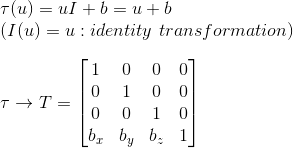

```
\\\tau(u)=uI+b=u+b
\\(I(u)=u:identity\ transformation)
\\\\\tau \rightarrow T=\begin{bmatrix}
1 & 0 & 0 & 0\\ 
0 & 1 & 0 & 0\\ 
0 & 0 & 1 & 0\\ 
b_{x} & b_{y} & b_{z} & 1
\end{bmatrix}
```

b가 0이면 아핀변환은 보통의 선형변환과 동일한 계산을 수행한다. 따라서 모든 선형변환은 4x4의 아핀변환으로 표기할 수 있다.

# 3. 변환들의 합성

S가 비례행렬이고 R이 회전행렬, T가 이동행렬이라고 할 때, 임의의 정점 v에 세 변환을 연달아 적용하는 방법은 두 가지가 있다. 행렬을 차례대로 적용하는 방법과 행렬의 곱을 적용하는 방법이다.

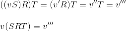

```
\\((vS)R)T=(v'R)T=v''T=v'''
\\\\v(SRT)=v'''
```

행렬을 차례대로 적용하는 방법은 정점의 수가 많아질 때 계산에 많은 자원이 소모된다. 예를 들어 정점이 2만개가 된다면 차례대로 적용할 경우 계산 횟수는 20000 x 3 = 60000이 된다. 하지만 행렬의 곱을 적용하면 계산 횟수는 20000 + 2 = 20002가 된다.

# 4. 좌표 변경 변환

한 좌표계의 좌표를 다른 좌표계의 좌표로 변환하는 것을 좌표 변경 변환(change of coordinate transformation)이라고 한다.

물체의 기하구조가 실제로 움직였거나 변형된 것으로 간주하는 회전, 이동, 비례변환과는 대조적으로 좌표계가 변경되어 기하구조의 좌표'표현'이 변하게 된다.


위의 그림은 두 좌표계 A와 B, 그리고 벡터 p가 있을 때 좌표계 B에 상대적인 p의 좌표를 도식으로 보여주고 있다. 위의 그림에서 u와 v를 좌표계 A의 x축과 y축 방향의 단위벡터라고 한다면, 다음과 같이 표현할 수 있다.

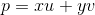

```
p=xu+yv
```

이 식의 벡터들을 좌표계 B에서 동일한 방식으로 표현할 수 있다.

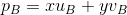

```
p_{B}=xu_{B}+yv_{B}
```

따라서, 좌표계 B에 상대적인 벡터 `u_{B}`와 `v_{B}`를 알면 항상 `p_{B} = (x',y')`를 구할 수 있다. 이를 3차원으로 일반화하면, 다음과 같이 표현할 수 있다. `u_{B}, v_{B}, w_{B}`는 각각 x,y,z축 방향 단위벡터들을 좌표계 B에 상대적으로 표현한 벡터들이다.

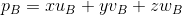

```
p_{B}=xu_{B}+yv_{B}+zw_{B}
```

점에 대한 좌표 변경 변환은 벡터에 대한 것과 약간 다르지만, 계산 방법은 비슷하다. 좌표계 B에 상대적인좌표계 A의 원점을 알면 나머지는 벡터 계산과 동일하다.


위의 그림에서, 좌표계 B의 점 `p_{B}`는 다음과 같이 표현할 수 있다.


```
p_{B}=xu_{B}+yv_{B}+Q_{B}
```

3차원으로 일반화하면, 다음과 같이 표현할 수 있다. `u_{B}, v_{B}, w_{B}`는 각각 x,y,z축 방향 단위벡터들을 좌표계 B에 상대적으로 표현한 벡터들이고, `Q_{B}`는 좌표계 A의 원점을 좌표계 B에 상대적으로 표현한 점이다.

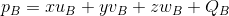

```
p_{B}=xu_{B}+yv_{B}+zw_{B}+Q_{B}
```

좌표 변경 변환도 동차좌표를 사용하여 벡터와 점을 처리하는 하나의 공식으로 만들 수 있으며, 행렬로 표현할 수 있다.

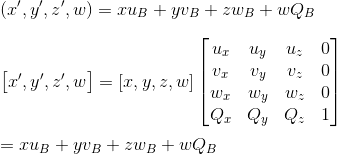

```
\\(x',y',z',w)=xu_{B}+yv_{B}+zw_{B}+wQ_{B}
\\\\\left[x',y',z',w\right]=[x,y,z,w]\begin{bmatrix}
u_{x} & u_{y} & u_{z} & 0\\ 
v_{x} & v_{y} & v_{z} & 0\\ 
w_{x} & w_{y} & w_{z} & 0\\ 
Q_{x} & Q_{y} & Q_{z} & 1
\end{bmatrix}
\\\\=xu_{B}+yv_{B}+zw_{B}+wQ_{B}
```

위의 식에서 표현된 4x4 행렬을 좌표 변경 행렬(change of coordinate matrix) 또는 좌표계 변경 행렬(change of frame matrix)라고 부르고, 행렬이 수행하는 변환을 지칭할 때 "변환한다(convert)" 또는 "사상한다(map)"라고 말한다.

# 5. 변환 행렬 대 좌표 변경 행렬

'능동적'변환(비례, 회전, 이동)과 좌표 변경 변환은 수학적으로 동치(equivalence) 관계이다. 능동 변환을 좌표 변경 변환으로 해석하는 것이 가능하며, 그 역도 마찬가지이다.


(a)에서는 하나의 좌표계 B를 기준으로 아핀변환을 적용해서 입방체의 위치와 방향을 변경한다. (b)에서는 A와 B라는 두 개의 좌표계를 사용하여 A에 상대적인 입방체 점들의 좌표를 B에 상대적인 좌표들로 변환한다. 두 경우 모두 좌표계 B를 기준으로 `\alpha(p) = (x',y',z',w) = p_{B}`가 성립한다. b = Q이고 `\tau(i) = u, \tau(j) = v, \tau(k) = w`이다.
