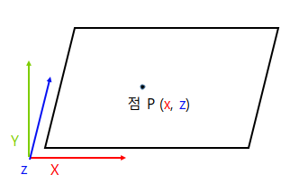
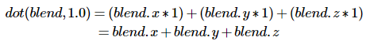
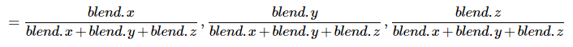
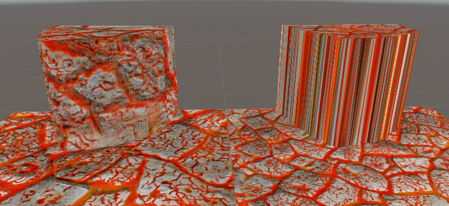

# Abstract

트리플라나 매핑에 대해서 알아봅니다.

# Shader

```c

Shader "UnityShaderTutorial/triplanar" {
    Properties
    {
        _Texture ("Texture", 2D) = "white" {}
        _Tiling ("Tiling", Float) = 1.0
    }

    SubShader
    {
        Pass
        {
            CGPROGRAM
            #pragma vertex vert
            #pragma fragment frag
            #include "UnityCG.cginc"

            struct v2f
            {
                half3 objNormal : TEXCOORD0;
                float3 coords : TEXCOORD1;
                float4 pos : SV_POSITION;
            };

            float _Tiling;

            v2f vert (float4 pos : POSITION, float3 normal : NORMAL)
            {
                v2f o;
                o.pos = UnityObjectToClipPos(pos);
                o.coords = pos.xyz * _Tiling;
                o.objNormal = normal;
                return o;
            }

            sampler2D _Texture;
            
            fixed4 frag (v2f i) : SV_Target
            {
                // use absolute value of normal as texture weights
                half3 blend = abs(i.objNormal);
                // make sure the weights sum up to 1 (divide by sum of x+y+z)
                blend /= dot(blend, 1.0);
                // read the three texture projections, for x,y,z axes
                fixed4 cx = tex2D(_Texture, i.coords.yz);
                fixed4 cy = tex2D(_Texture, i.coords.xz);
                fixed4 cz = tex2D(_Texture, i.coords.xy);
                // blend the textures based on weights
                return cx * blend.x + cy * blend.y + cz * blend.z;
            }
            ENDCG
        }
    }
}

```

# Description

지형이나 동굴 같은 텍스처에는 UV 좌표를 사용하기가 쉽지 않습니다.
UV 좌표는 그리드에서 펼쳐지며 XY 평면에 고르게 배치되는데 지형의 높이차이를 고려하지 않고 늘이기를 유발하기 때문에 텍스처가 뒤틀려 있습니다.
이 때 트리플라나 매핑 기술을 사용합니다.

트리플라나 매핑은 UV 좌표를 사용하지 않고, 정점 쉐이더에서 물체의 로컬 좌표나 월드 좌표를 반환하고 조각쉐이더에서 새로운 UV 좌표를 만들어서 물체에 투영시키는 기법입니다.

## 투영 평면 계산

* Y 평면에 대한 투영



특정 평면에 대해 새로운 UV 좌표를 얻기 위해 해당 축 이외의 성분으로 좌표를 구성합니다.
Y축에 대한 평면을 계산한다고 하면 새로운 UV 좌표는 로컬 좌표 `(x, z)`가 해당됩니다.

이 작업을 X, Y, Z에 축에 대해 세번 진행하여 각 축의 평면에 해당하는 새로운 UV 쌍을 만들어냅니다.

```
i.coords.yz; // X
i.coords.xz; // Y
i.coords.xy; // Z
```

## 법선

위에서 계산된 좌표를 기반으로 텍셀값을 얻어오면 평면이 향한 방향에 따라 가중치를 곱하여 텍셀에 혼합을 해줘야 이상적인 결과물이 나옵니다.

가중치를 구하기 위해 물체의 법선을 사용합니다.

```
half3 blend = abs(i.objNormal);
blend /= dot(blend, 1.0)
```

X, Y, Z 평면에 대해서만 투영을 하고 있기 때문에 절대값을 취해 음수를 없애고, 법선 벡터의 각 성분값들의 합을 `1`로 만들기 위해 1과 내적한 뒤, 자기 자신과 나눕니다.



위에서 구한 스칼라 값으로 `blend` 변수와 나누기를 합니다.



## 결과


