# Abstract

벡터대수를 정리한다.

# 벡터

벡터는 크기와 방향을 모두 가지고 있는 값을 나타낸다.
Ex) 힘(특정 강도와 특정 방향), 속도(속력과 방향)

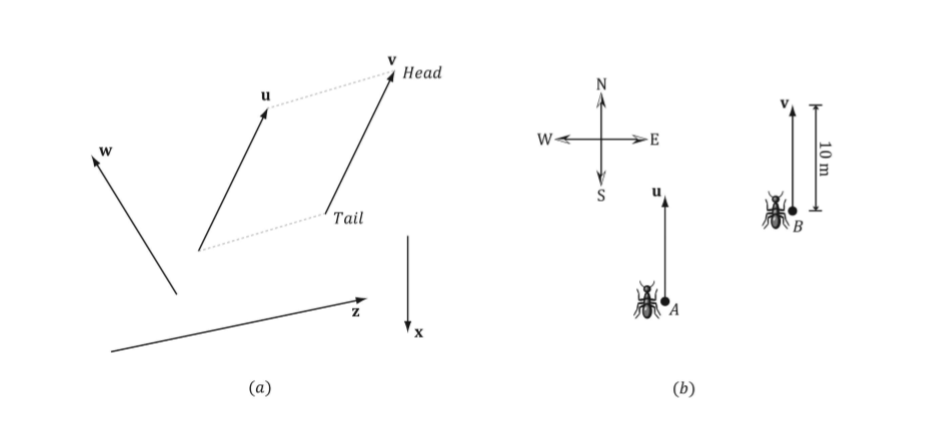

위 그림은 벡터를 기하학적으로 표현한것이다. 화살표의 길이는 벡터의 크기를 나타내며 가라키는 목표는 방향을 나타낸다. 
그려지는 위치가 다르거나 변경되어도 벡터의 크기나 방향이 바뀌지 않으므로 벡터를 그릴 위치는 중요하지 않다. 

두 벡터가 같은 길아와 방향을 가질 경우 동일하다고 가정한다. (그림 1.1(a) 에서 u와 v, 1.1(b)에서 u와 v는 동일한 벡터이다)

## 벡터의 기본 연산

+ u = (1, 2, 3), v = (1, 2, 3), w = (3, 0, -2), k = 2 라고 가정한다.  

### 1. 두 벡터의 덧셈  

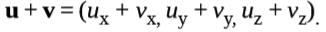  

u + w = (1, 2, 3) + (3, 0, -2) = (4, 2, 1);

### 2. 두 벡터의 뺄셈  

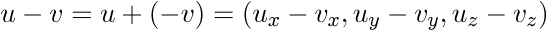  

u - v = u + (-v) = (1, 2, 3) + (-1, -2, -3) = (0, 0, 0) = 0;

### 3. 벡터와 스칼라의 곱셈  

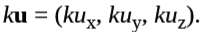  

kw = 2(3, 0, -2) = (6, 0, -4);

+ 스칼라는 크기만 있고 방향은 없는 값을 뜻한다. 일반적으로 우리가 사용하는 숫자들이 스칼라이다. ex) 속도는(속력과 방향) 벡터값이지만, 속력은 방향을 가지지 않는 스칼라이다.

# 길이와 단위벤터

## 벡터의 크기(길이)

벡터를 표현하는 선분의 길이는 벡터의 크기이다.  

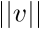 (절대값과 구분하기 위해 '|' 를 두개 사용) 

n차원에서 벡터 v의 크기를 구하는건 공식으로 존재한다.  

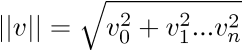  

1차원에서는 벡터의 방향은 한 방향 뿐이고 주어진 좌표가 곧 벡터의 크기이다.
벡터 v = (10) 이면 벡터의 크기는 10이다.

2차원에서는 피타고라스의 정리를 이용, 삼각형의 빗변의 길이가 곧 벡터의 크기이다. 

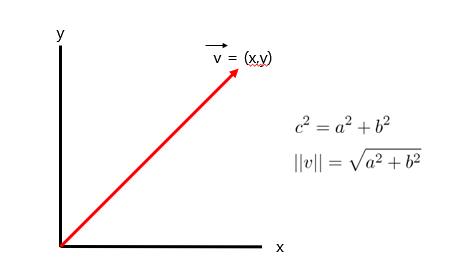

3차원에서는 피타고라스의 정리를 2번 적용하여 벡터의 크기를 구할 수 있다.

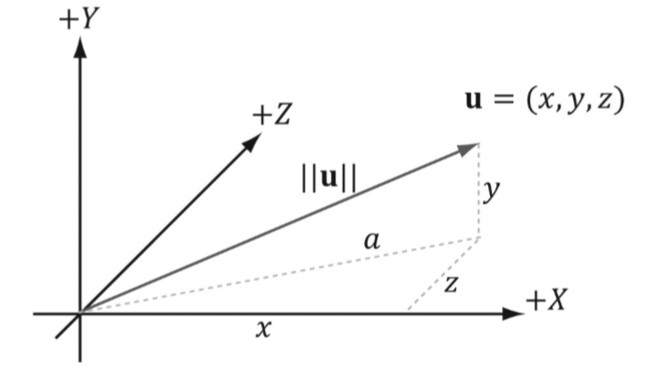  

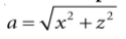  

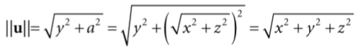  

두개의 평면으로 분할한다고 생각하고 x와 z에 대해 피타고라스의 정리를 적용하여 a를 구하고 a와 y에 대해 한번더 적용하면 벡터의 크기를 구할 수 있다.

## 단위벡터

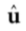  

벡터의 크기가 1인 벡터를 단위벡터라 한다. 이는 크기와 상관없이 순수하게 방향만 가지고 있는 벡터이다.

단위 벡터는 벡터의 각 요소를 크기로 나눔으로서 구할 수 있다. 이 과정을 정규화(Normalize)라고 한다.

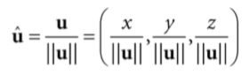  

예제를 통해 벡터의 크기와 단위벡터를 구하는 과정을 알아보자  
벡터 v = (-1, 3, 4)라고 가정한다. 벡터의 크기를 구하는 공식을 적용하면

  

벡터의 크기를 얻을 수 있고, 벡터의 크기로 각 벡터의 요소를 정규화한다.

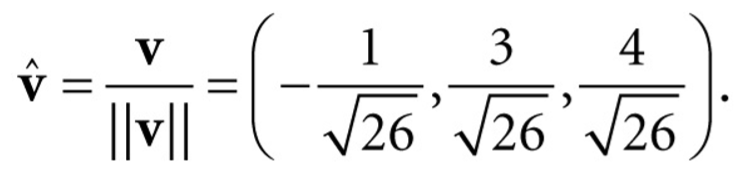  

최종적으로 방향만 가지고 있는 단위벡터를 얻을 수 있다.

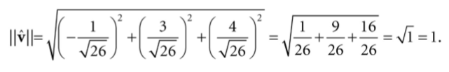

# 내적

벡터의 내적(dot product, inner product, scala product)은 두 벡터를 곱한값이다. 기호로 `'·'`을 사용하고 결과물은 항상 스칼라값이 나온다.

벡터의 내적을 구하는 방법엔 2가지가 있다. 
첫번째로 각 벡터의 요소들을 곱해서 더하는 것이다. 

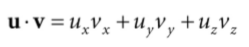

두번째는 벡터의 크기를 곱하는 것이다. 

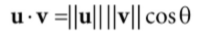

첫번째의 벡터의 내적을 구하는 공식은 사실 큰 의미가 없고, 두번째의 공식에서 구할 수 있는 코사인(사이각) 으로 내적이 활용된다. 또한 여러 유용한 내적의 기하학적 특성을 제공한다.

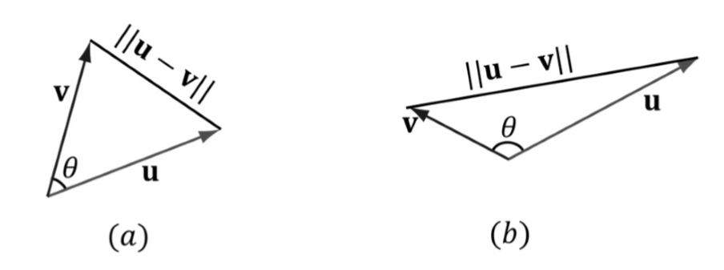

1. 내적의 값이 양수일때 사이각은 예각이다.
2. 내적의 값이 음수이면 사이각은 둔각이다.
3. 내적의 값이 0이면 수직이다.

예제를 통해 알아보자 사이각 코사인 세타를 구해보자 
벡터 u = (1, 2, 3), v = (-4, 0, -1) 이라 가정한다.

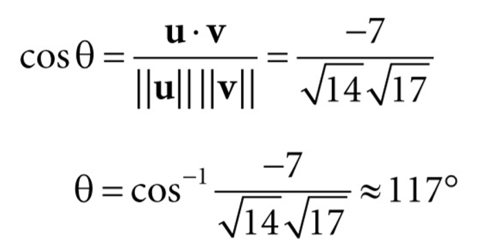

먼저 첫번째 공식을 사용하여 내적의 값을 구한다. 그다음 두번째 공식을 응용하여 각 벡터의 내적을 두 벡터의 크기를 곱한값으로 나누면 코사인 세타(-0.45)의 값이 나온다.
코사인 120도의 값이 -0.5정도이기에 계산이 잘 이루어진것을 확인할 수 있다.

이렇게 구한 두 벡터의 내적으로 벡터간의 사이각을 알 수 있고, 이는 게임에서 플레이어와 적의 앞뒤를 구분한다던가, 플레이어의 시야각을 구하거나 하는등 많은 용도로 사용 된다.

# 외적

벡터의 외적(cross product, outer product)은 내적과 같이 두벡터를 곱한값이다. 하지만 내적과는 다른 특성이 존재한다.

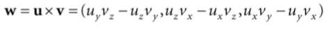

1. 외적의 결과물은 두 벡터에 대한 수직인 벡터이다.
2. 벡터의 외적은 3차원 벡터에서만 적용된다.

예제를 통해 외적을 구해보자 
벡터 u = (2, 1, 3), v = (2, 0, 0)이라 가정한다.

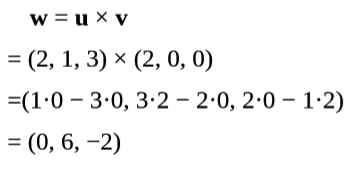 

각 벡터의 요소를 곱하여 외적을 구하였다. 이제 실제로 해당 벡터에 수직인 벡터인지 확인을 해본다. 이는 위에서 설명한 벡터의 내적 특성을 이용한다.

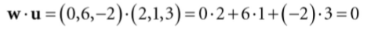  

벡터 외적의 결과인 w를 벡터 u와 내적을 하면 0이 나온다. 즉, 벡터 w를 u에 대해 수직인 벡터이다.  

외적의 특성중 또 하나로 내적과 달리 교환법칙(w = u x v = v x u) 가 성립하지 않는다. 두 벡터를 곱하는 순서를 바꾸면 반대 반향의 벡터가 나온다.  

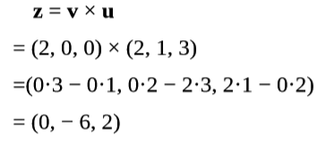

# 점

지금까지 위치를 사용하지 않은 벡터에 대해 얘기를 해왔지만, 벡터를 사용하여 공간상에서 위치를 나타낼 수 있다. 이 벡터를 위치벡터라 부른다.

위치 벡터는 원점 `'O'`를 시점으로 하는 벡터를 위치 벡터라 한다. 공간이나 평면상에서 같은 방향과 크기를 가지를 벡터는 무수히 많지만 위치 벡터는 유일하게 1개만 존재하게 되어서 특정한 점의 위치를 벡터로 사용하는 것이 가능해진다.

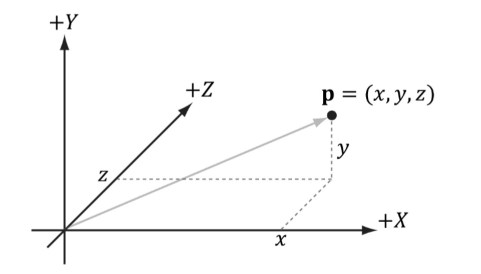

흩어져 있는 벡터들은 서로 연산을 하기도, 평행여부를 확인하기도 어렵다. 그렇다고 매번 벡터들을 평행이동하여 원점으로 가져와서 사용하기엔 번거롭다.

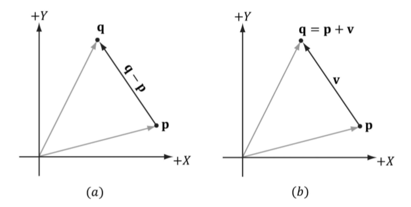

이 경우 원점에서 뻗은 위치벡터를 이용하여 벡터나 점의 위치를 알 수 있다.
그림 (a)의 경우 점 q에 대한 위치벡터와 점 p에 대한 위치벡터를 빼면 q-p의 벡터를 알 수 있다. 그림 (b)의 경우 점 p에 대한 위치벡터에 q-p로 부터 얻은 백터를 덧셈하면 점q의 위치를 알 수 있다.
